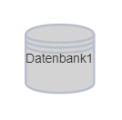
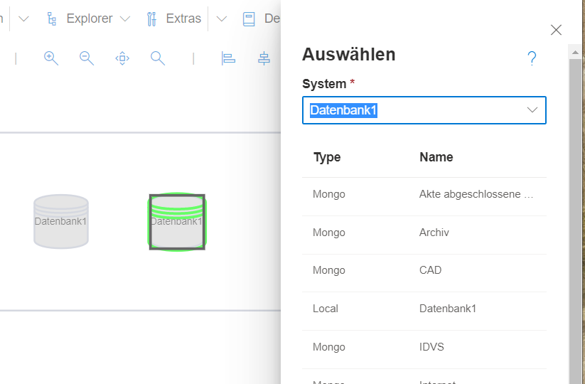
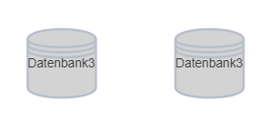
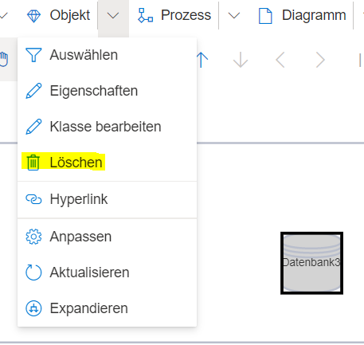
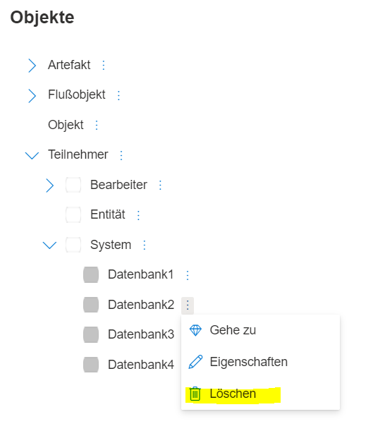

SemTalk Online setzt auf ein objektorientiertes Modellierungskonzept, d.h. viele der Modellelemente werden als Objekt angelegt und können an verschiedensten Stellen mehrfach verwendet, aber auch zentral bearbeitet werden.
Das hat viele Vorteile. Denn alle Eigenschaften, die ein Objekt erhält, sind bei allen verwendeten Instanzen des Objektes zu finden. Dies können Kommentare sein, Attribute oder Übersetzungen. Auch lässt es sich durch das objektorientierte Konzept verhindern, dass gleiche Dinge mit unterschiedlichen Namen modelliert werden, da alle Modellierer auf bereits existierende Objekte zurückgreifen können. 

Zu diesen objekt-basierten Elementen gehören u.a.:

* Rollen/Prozessteilnehmer (BPMN)
* Systeme/Datenspeicher (BPMN)
* Datenobjekte (BPMN)
* Organisationseinheiten
* Service (EPK)
* Sachmittel (EPK)
* Klasse (EPK)
* Fachbegriffe (EPK)

Beim Umgang mit Objekten gilt es einiges zu beachten:

# Objekte benennen/umbenennen

Beispielhaft wird das Thema Objektbenennung mit einem BPMN System nachfolgend genauer erklärt.

Ein System wird auf das Zeichenblatt gezogen. Es ist daraufhin möglich, einen Doppelklick auf das System zu machen und diesem einen Namen zu geben, z.B. Datenbank1.

SemTalk Online benennt nicht nur das Systemshape in "Datenbank1", sondern legt auch im Hintergrund eine Instanz der Klasse "Datenbank" namens "Datenbank1" an, welches an anderer Stelle in der Modelldatei wiederverwendet werden kann.

Um das Objekt erneut verwenden zu können, wird ein weiteres Systemshape auf das Zeichenblatt geschoben. Nun gibt es zwei Möglichkeiten, "Datenbank1" erneut zu verwenden.

1. Das neue Shape wird ebenfalls über die Doppelklick-Methode benannt. Semtalk erkennt automatisch, dass "Datenbank1" bereits existiert, und nutzt das bestehende Objekt auch für das neue Shape.
2. _(Empfohlen)_ Der Auswahldialog wird verwendet. Dafür wird rechts auf das Systemshape geklickt, um im Kontextmenü "Auswählen" zu verwenden. Es öffnet sich ein Dialog, welcher alle bereits existierenden System-Objekte enthält. Der Benutzer kann durch diese Objekte scrollen und durch Anklicken das benötigte Objekt aussuchen, oder in der Eingabebox einen Namen eingeben. Existiert dieser noch nicht, wird er als Objekt neu angelegt. Falls er schon vorhanden ist, wie beim Beispiel "Datenbank1", macht SemTalk Online automatisch Vorschläge, die zur Eingabe passen. Der Benutzer kann also "Datenbank" eingeben und bekommt "Datenbank1" vorgeschlagen. Mit der Enter-Taste lässt sich der Vorschlag übernehmen, so dass das Systemshape nun ebenfalls den Namen "Datenbank1" besitzt.

Der Auswahldialog existiert für diejenigen Modellelemente in SemTalk, die objektbasiert verwendet werden können, so also auch für alle weiter oben genannten Elemente. Er ist nicht anwendbar für Objekte, die nur einmal dagestellt werden wie Prozessschritte, Ereignisse oder Gateways. 

Es gibt nun zweimal die Datenbank1 auf dem Zeichenblatt. Das bedeutet, dass dieselbe Datenbank an verschiedenen Stellen im Prozess verwendet wird.
Wenn sich herausstellt, dass die Benennung nicht korrekt ist, weil es sich bei der verwendeten Datenbank eigentlich um Datenbank3 handelt, vlt. weil die IT Abteilung die Datenbank umbenannt hat, lassen sich beide Shapes in einem Schritt umbenennen. Dafür muss ein Shape rechts angeklickt und aus dem Kontextmenü "Eigenschaften" geöffnet werden. Dort kann der Name der Instanz abgeändert werden. Dieser wird dann für beide Shapes der Instanz "Datenbank1" übernommen, so dass das Objekt "Datenbank1" nun "Datenbank3" heißt.

# Objekte löschen

Beim Löschen von Objekten muss zwischen zwei Varianten unterschieden werden.

1. **Löschen des Shapes**
Soll nur das Datenbank Shape vom Zeichenblatt entfernt werden, lässt sich das durch Selektieren das Shapes und Klicken der "Entf"-Taste oder durch Rechtsklick --> "Löschen (Symbol)" erledigen. Dies hat keine Auswirkungen auf andere Shapes, die mit dem selben Objekt angelegt wurden. Das Objekt existiert weiterhin in der Modelldatei und kann an anderer Stelle erneut verwendet werden. 
**Hinweis:** Die Begriffe "Shape" und "Symbol" werden synonym verwendet.  

2. **Löschen des Objektes**
Wenn das Objekt aus der Modelldatei entfernt werden soll, kann ein Shape, welches das Objekt verwendet, selektiert und dann im Menüpunkt "Objekt" --> Löschen gewählt werden. Das Objekt wird nun aus der Modelldatei entfernt. Hierbei ist Vorsicht geboten, da damit natürlich auch alle Shapes vom Zeichenblatt verschwinden, die das Objekt verwenden.

Gibt es Objekte, die nicht auf einem Zeichenblatt zu finden sind, kann der Menüpunkt "Explorer" --> "Objekte" genutzt werden. Dort lassen sich alle Objekte des Modells mittels einer Baumstruktur einsehen. Systeme sind beispielsweise unter Teilnehmer zu finden. Wird "Teilnehmer"-->"Systeme" aufgeklappt, werden alle System-Objekte angezeigt und können über das 3-Punkte Menü gelöscht werden.

