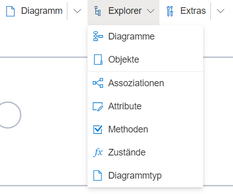
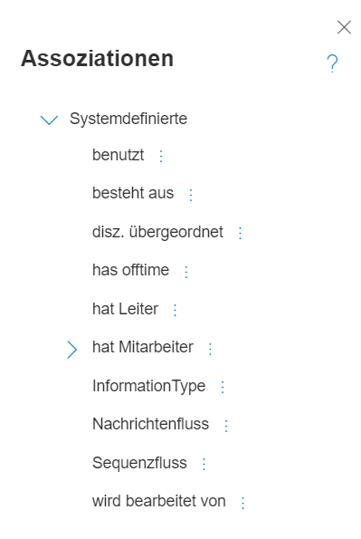
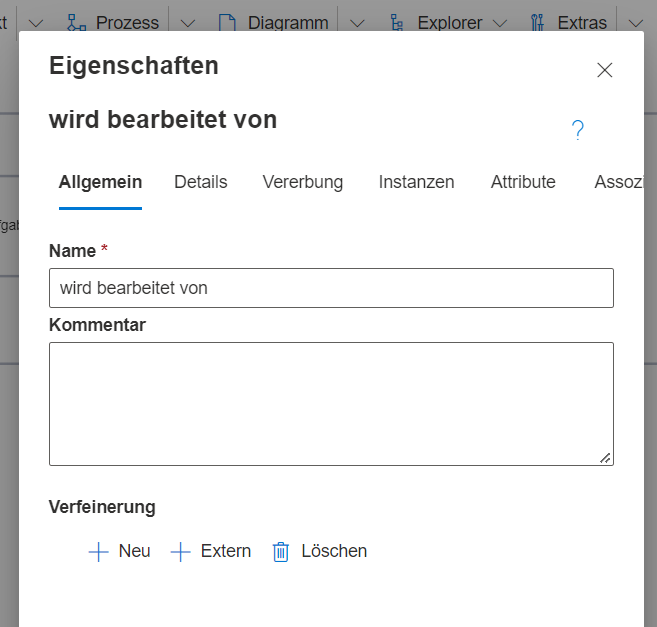

Über den Menüeintrag "Explorer" --> "Assoziationen" können alle Assoziationsklassen im Modell bearbeitet und ergänzt werden. 

Ein "Assoziation" ist eine Beziehung zwischen zwei Objekten, die vom Editor angelegt werden kann. Jede Assoziation hat eine Klasse, die Assoziationsklasse von der sie z.B. die Attribute erbt. In der Ontologiemodellierung entstehen Assoziationsklassen "automatisch", wenn ein Benutzer eine Kannte benennt. In OWL entsprechen die Assoziationen "ObjectProperties".  

Die meisten Vorlagen enthalten bereits vordefinierte Assoziationsklassem. Von einem Anwender mit Administratorrolle können Weitere hinzugefügt werden.

Über das Drei-Punkte-Menü kann der Administrator das Eigenschaftenmenü einer bestimmten Assoziationsklasse öffnen, um bspw. den Namen zu ändern, Übersetzungen hinzuzufügen oder die Logik der Assoziation zu ändern. Unterassoziationen können ebenfalls angelegt werden.

