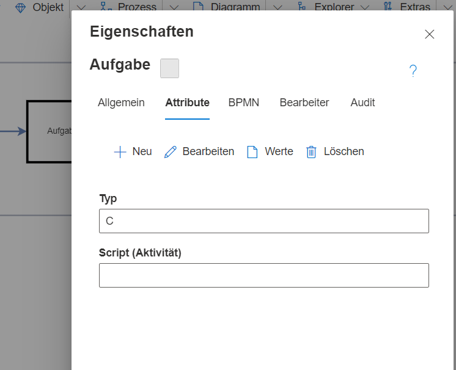
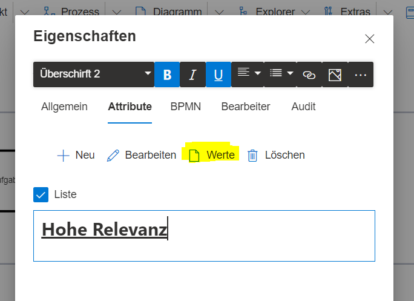

**Attribute** sind system- oder benutzer-definierte Eigenschaften eines SemTalk-Objektes, um dieses besser beschreiben zu können oder zusätzliche Informationen in den Prozess zu integrieren. 

# Attribute im Eigenschaftendialog pflegen

Attribute werden auf der Registerkarte „Attribute“ im Eigenschaften-Dialog angezeigt. Sie können dort angelegt, geändert und mit Werten
belegt werden. Ein Attribut besteht dabei aus einem Namen und einem Wert. Beispielweise können Aufgaben in einem BPMN-Prozess über ein Attribut kategorisiert werden oder mit ergänzenden Informationen wie Ansprechpartner, Telefonnummer, URL oder Zeitwerten versehen werden. SemTalk enthält zwar bereits vordefinierte Attribute(systemdefinierte Attribute), da aber weitere Attribute je nach Modellkontext dynamisch hinzugefügt werden können, ist der Art der Information keine Grenze gesetzt(benutzerdefinierte Attribute). Über den Eigenschaften-Dialog können Attribute jedoch nur eingeschränkt neu angelegt werden. Alle neuen Attribute werden dort grundsätzlich mit dem Datentyp "String" angelegt und sind somit einfache Textfelder. Wie andere Datentypen verwendet werden können und welche Konfigurationsmöglichkeiten außerdem noch existieren, können Sie weiter unter auf dieser Wiki-Seite im Abschnitt "Komplexe Attribute erstellen" erfahren.

Über den "Werte"-Button ist es möglich, den Attributwert mit einfachen Mitteln zu formatieren, um den Wert für den Leser besonders hervorzuheben. Verwenden Sie "Werte" um längere Text einfacher bearbeiten zu können.

# Registerkarte für Attribute Ein/Ausblenden

Ist die Registerkarte "Attribute" bei einem Objekt nicht vorhanden, kann dies über den Menüeintrag "Objekt" --> "Anpassen" geändert werden. Dafür muss zumindest ein Objekt der Klasse selektiert werden, z.B. ein Aufgabenshape, wenn die Attribute-Registerkarte für BPMN-Aufgaben eingeblendet werden soll. Im Anpassen-Dialog lässt sich anschließend das Aussehen und Verhalten der Objektklasse ändern. Es lässt sich dort auch die Attribute-Registerkarte aktivieren oder deaktivieren.
Dafür wird jedoch ein Benutzer mit Administratorrolle benötigt.

# Komplexe Attribute erstellen
Beim Erstellen von Attributen gibt es zahlreiche Möglichkeiten. Der volle Umfang ist jedoch nur für Benutzer mit Administratorrolle verfügbar.
Unter dem Menüpunkt "Explorer" --> "Attribute" ist der Dialog zur Verwaltung aller Attribute zu finden.
Grundsätzlich wird hier zwischen systemdefinierten Attributen und benutzerdefinierten unterschieden. Systemdefinierte sind bereits standardmäßig für die Notation angelegt, während benutzerdefinierte Attribute durch die Modellierer bzw. den Modelladministrator bearbeitet werden können.

Im Beispiel wurde das Attribut "Typ" über den Eigenschaften-Dialog angelegt. Dieses Attribut soll nun bearbeitet werden. Dafür wird das Drei-Punkte-Menü geöffnet und "Eigenschaften" ausgewählt. Es öffnet sich ein Dialog zum Bearbeiten von Attributtypen. Im Tab "Allgemein" lässt sich der Name ändern oder ein Kommentar hinterlassen. Im Sprach-Tab können Übersetzungen für die Modellsprachen hinterlegt werden, falls benötigt.
Der Details-Tab enthält Felder zum Konfigurieren des Attributes. So ist z.B. der Datentyp änderbar. Eine Vielzahl an Datentypen steht zur Auswahl bereit - von Texttypen wie String, URL, Mail über Zahlentypen wie Integer oder Float oder über Datums- sowie Zeitangabefelder, bis hin zum Boolean Wert (Wahr oder Falsch) ist alles möglich. Darüber hinaus kann auch angegeben werden, ob das Attribut ein Pflichtfeld sein soll, d.h. ob es befüllt werden muss.

Die Oberfläche zum Eingeben der Attributwerte ändert sich dann automatisch zum Datentyp passend (Boolean bekommt eine Checkbox, Datumsangabe bekommt einen Kalender).

# Attribute dauerhaft zu Objektklassen zuweisen

Sollen Attribute für alle Elemente einer Klasse dauerhaft verfügbar sein, z.B. für alle Aufgaben in der BPMN-Notation, muss dies durch einen Benutzer mit Administrationsrolle eingestellt werden.
Dazu wird im Menüeintrag "Explorer" --> "Objekte" die entsprechende Objektklasse ausgewählt, z.B. hier "Aufgabe". Über das Drei-Punkte-Menü können die Eigenschaften der Aufgabenklasse aufgerufen werden.

Dort findet sich der Tab "Attribute", worin alle Attribute, die dieser Klasse zugeordnet sind, aufgelistet werden. In einer BPMN-Aufgabe gibt es bereits zahlreiche Attribute, die für die Notation oder die Simulationskomponente als systemdefinierte Attribute existieren. Es kann aber durch Klick auf den "Neu"-Button ein weiteres Attribut hinzugefügt werden. Dieses kann bereits existieren, wie z.B. das Typ-Attribut, was auf dieser Wiki-Seite bereits exemplarisch angelegt wurde. Es ist aber ebenfalls möglich, an dieser Stelle auch ganz neue Attribute zu erstellen und diese so zu konfigurieren wie im Abschnitt "Komplexe Attribute erstellen" beschrieben.

Alle Attribute, die der Aufgabenklasse hinzugefügt werden, sind anschließend in allen Aufgabenshapes Ihres BPMN-Modells vorhanden. Auf dieselbe Art und Weise lassen sich Attribute für alle Objektarten (egal aus welcher Notation) hinzufügen.

