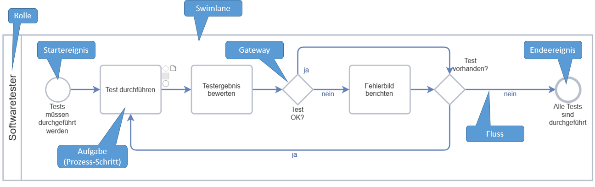

# Überblick
Geschäftsprozesse werden in SemTalkOnline standardisiert mit Hilfe der "Business Process Model And Notation" graphisch beschrieben. Dazu stellt  die BPMN bestimmte Symbole zur Verfügung, die der Anwender in SemTalkOnline von einer so genannten Schablone auf die Zeichenfläche ziehen kann. 
Die BPMN ist derzeit aktuell als [BPMN 2.0](https://www.omg.org/spec/BPMN/2.0/) auf den Webseiten der ObjectManagementGroup (OMG) publiziert. 

# Kernelemente
Zur Beschreibung eines Geschäftsprozesses genügen einige wenige "Kernelemente", die im Folgenden aufgelistet und kurz erklärt sind
* **Ereignis**  
Ereignisse beschreiben singuläre Vorkommnisse, die einen Geschäftsprozess steuern. Dazu zählen im wesentlichen ein Start- und ein Endeereignis, um
die Reichweite eines Geschäftsprozesses zu umreißen. Mit anderen Worten: Wann startet und wann endet ein Prozess. 
Darüberhinaus kann es aber noch Zwischenereignisse geben, die ggf. einen Prozess auch unterbrechen können.
* **Aufgabe**  
Eine Aufgabe ist ein Prozessschritt, der eine bestimmte Tätigkeit in einem Geschäftsprozess beschreibt. Die Aneinanderreihung von Aufgaben ergibt dann
den gesamten Prozess. Man kann daher (mit Ausnahme der ersten und der letzten Aufgabe) für jede Aufgabe einen Vorgänger und einen Nachfolger angeben.
In der Regel wird eine Aufgabe (mindestens) durch die Kombination eines Substantivs (Objekt) mit einem Verb (Methode) definiert, z.B. "Vorkommnis eintragen".
Aber auch die Erweiterung durch Hinzufügen einer so genannten Adverbialphrase ist möglich, etwa "Vorkommnis ins Logbuch eintragen", was dann zu mehr Klarheit im Verständnis einer Aufgabe führt.  
**Hinweis / Best Practice:** In SemTalkOnline  sollte man die Adverbialphrase immer der Methode, also dem Verb zuschlagen.
* **Gateway / Verzweigung** 
Ein Gateway bzw. eine Verzweigung ist eine Stelle im Geschäftsprozess, an der eine Abfrage vorgenommen wird, wie es im Prozess weitergehen soll.
In der Regel läßt die Abfrage dann mehrere Möglichkeiten zu, so daß ein Gateway auch eine Verzweigung darstellt, und der Prozessnutzer sich dann für 
eine Nachfolgeraufgabe entscheiden muß.
* **Fluss** 
Der Fluss (dargestellt durch einen gerichteten Pfeil) verbindet Aufgaben miteinander und definiert somit auch die Reihenfolge, in der die einzelnen Aufgaben abgearbeitet werden sollen.
* **Swimlane (mit Rolle)** 
Jede Person, die an einem Prozess beteiligt ist, also eine oder mehrere Aufgaben darin ausführt, erledigt dies als Inhaber einer Rolle.
Rollen haben den Vorteil, daß der Geschäftsprozess unabhängig von Personen definiert werden kann. 
Alle Aufgaben, die von einer Rolle wahrgenommen werden, werden innerhalb einer so genannten "Swimlane" notiert. Jeder Rolle wird eine eigene Swimlane
zugewiesen, so daß klar erkennbar ist, welche Aufgaben durch welche Rolle erledigt werden.

# Graphisches Beispiel

Die folgende Graphik zeigt ein einfaches Beispiel eines Geschäftsprozesses in der BPMN 2.0 Notation.

Grundsätzlich liest man Geschäftspozesse von links nach rechts. Demgemäß beginnt ein Prozess immer mit einem Startereignis und endet mit einem Endeereignis. Dazwischen gibt es eine Abfolge von Prozess-Schritten/Aufgaben, die durch die gerichteten Pfeile (Fluss) aufeinander folgen.
Auf eine Aufgabe kann ein Gateway folgen, das mit einer Abfrage verbunden ist. Je nachdem, wie die Abfrage ausfällt (meistens "Ja" / "Nein"), wird dann
der Ablauf im Prozess fortgesetzt. 
Der gesamte Prozessablauf ist in einer so genannten Swimlane eingebettet, damit zum Ausdruck gebracht werden kann, welche Rolle die einzelnen Aufgaben erledigt. Im obigen Beispiel stellen wir uns einen Softwaretester vor, der eine Reihe von Tests durchführen soll.