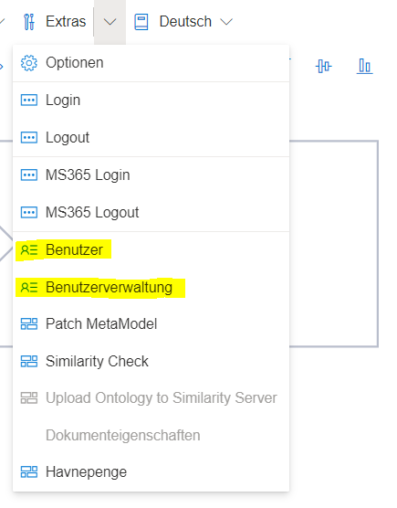
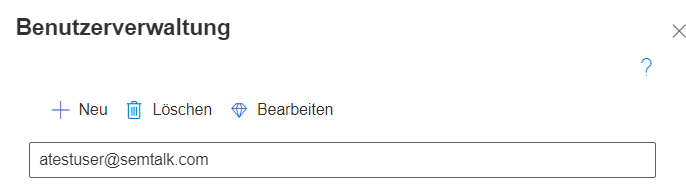
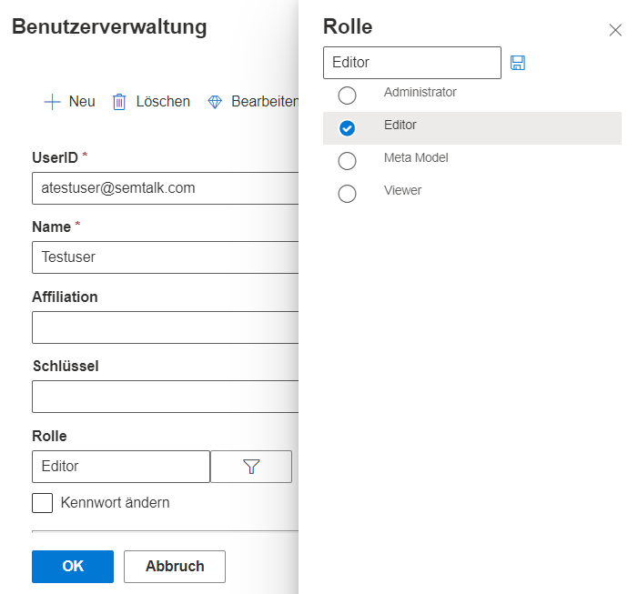

**In der Benutzerverwaltung kann ein Administrator** die Benutzer einsehen, bearbeiten und neu anlegen, 
die auf die Modelldatenbank zugreifen können sollen.
Im Menüeintrag "Extras" finden sich zwei Einträge:
* Benutzer: Hier können die Einstellungen des eigenen Benutzer eingesehen werden. Ebenso sind Änderungen am eigenen Profil möglich, wie z.B. das Ändern des Namens oder eine Passwortänderung. Dieser Menüpunkt ist auch für Editoren sichtbar.
* Benutzerverwaltung: Hier ist die gesamte Benutzerverwaltung zu finden, welche nur für Administratoren einsehbar ist.

Die Benutzerverwaltung zeigt alle existierenden Benutzer an. Es können neue Benutzer angelegt, vorhandene gelöscht oder bearbeitet werden.

Wird ein Benutzer selektiert und der Bearbeiten-Button geklickt, öffnet sich eine Detailansicht zu diesem Benutzeraccount. Darin kann der Name angepasst oder das Kennwort gesetzt werden. 
Ebenso können Rollen zugewiesen werden. Dabei sollte jedoch mit Vorsicht vorgegangen werden. Die Administrationsrolle, sollte nur für einige wenige Benutzer mit Expertise in SemTalk Online verwendet werden.

