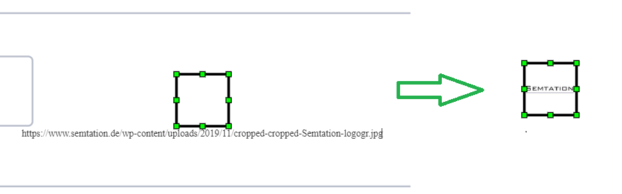

# SemTalk Online und Bilder

SemTalk Online erlaubt das Integrieren von Bildern in die Modellseiten zur visuellen Anreicherung des Modelles.

Dafür haben die meisten Schablonen ein Symbol namens "Bild" was auf dem Zeichenblatt platziert werden kann. Dieses Symbol dient als Container zur Darstellung des Bildes.

Die Integration der eigentlichen Bilddatei kann auf unterschiedliche Arten erfolgen:

* via externen Hyperlink: Diese Variante eignet sich für Bilder, die an einem externen Ort abgelegt sind und von dort in die Modelle geladen werden sollen. Der Vorteil davon ist dass Änderungen am Bild an diesem externen Ort gemacht werden können und danach auch automatisch in der Modelldatei ankommen, da SemTalk Online das Bild immer wieder neu nachladen muss um es darzustellen. Ebenso beeinflußt ein externer Hyperlink nicht die Größe der Modelldatei.
Nachteil dieser Variante kann sein dass das Modell keine Kontrolle über eine externe Bilddatei hat. So könnte das Bild unkontrolliert geändert oder gelöscht werden und würde dann ebenfalls in der Modelldatei geändert oder nicht mehr sichtbar sein. Ebenfalls könnte das Bild auch durch ein Berechtigungskonzept nicht allen Benutzern zugänglich sein. 
Zu beachten ist hierbei auch dass es sich um ein freizugängliches Bild handeln muss. Nicht jede Bilder-Url kann von einer anderen Quelle geladen werden.
* eingebettet in die Modelldatei als base64 kodierte Bilderzeichenkette: Soll das Bild fest in die Modelldatei integriert werden, kann das Bild als base64 kodierte Zeichenkette mit abgespeichert werden. Dazu lesen Sie bitte den Abschnitt: [Bilder nach base64 konvertieren](./Bilder-Manager#bilder-nach-base64-konvertieren)!
Der Vorteil davon ist dass das Bild nicht von einer externen Quelle geladen werden muss und für jeden Benutzer gleich über das Modell zugänglich ist. Ein Nachteil ist dass bei einer Änderung am Bild dies nicht an zentraler Stelle modellübergreifend gemacht werden kann und stattdessen in jeder Datei separat gemacht werden muss. Ebenso kann eine Modelldatei schnell sehr groß (auch zu groß) werden wenn viel mit eigebetteten Bildern gearbeitet wird, da diese natürlich entsprechenden Speicherplatz benötigen.
Diese Variante eignet sich daher am besten für Bilder die sich nicht oft ändern bzw. spezifisch zu einzelnen Modellen gehören und/oder von keiner verlässlichen externen Quelle bezogen werden können.

* An einzelnen Symbolen: Bilder können direkt an einzelnen Symbolen hinterlegt werden. Dies macht Sinn wenn ein Bild nur einmal in der Datei vorkommt.
* über eine zentrale Verwaltungsoberfläche: dem Bildermanager: Wird mit vielen Bildern gearbeitet und werden Bilder an den mehreren Stellen wiederverwendet, macht es Sinn über die Verwaltungsoberfläche für Bilder zu gehen. Hier lassen sich alle Bilder übersichtlich anlegen und in die Datei übernehmen. Auf diese Art können auch mehrere Modellierer gemeinsam Bilder verwalten und für das Modell bereitstellen.

# Bilder direkt am Symbol einfügen

Diese Variante gilt ausschließlich für Bilder, die als Hyperlink eingefügt werden sollen.
Ist ein Bild Symbol auf dem Zeichenblatt platziert, kann durch Doppelklick auf den Namen "Bild", den das Symbol initial bekommen hat, einfach ein Hyperlink als Text eingefügt werden.
Mit Enter oder klick an eine andere Stelle wird die Url übernommen und das Bild wird angezeigt.

# Bilder über den Formatierungsdialog hinzufügen

Ist ein Bild Symbol auf dem Zeichenblatt platziert, kann mit Rechtsklick --> Formatierung (oder Menü Symbol-->Formatierung) der Formatierungsdialog geöffnet werden. Dieser besitzt den Tab "Bild".

Hier kann entweder ein externer Hyperlink angegeben werden oder eine nach base64 konvertierte Bilddatei eingebettett werden. Dazu lesen Sie bitte wieder den Abschnitt: [Bilder nach base64 konvertieren](./Bilder-Manager#bilder-nach-base64-konvertieren)!

Danach kann das Bild in die Datei eingebettet werden.

Wird im Feld ID ein Name für das Bild eingetragen ist das angelegte Bild danach auch im Formatierungsdialog anderer Bild Symbole über die Auswahlbox mit dem Label ID wiederverwendbar.

# Der Bildermanager

## Den Bildermanager öffnen

Über den Menüpunkt Extras --> Anpassen --> Bildermanager wird der Bildermanager geöffnet.

Im nun geöffneten Fenster werden dann alle existierenden Bilder der Datei mit Namen, Inhalt, Größe und ob es bereits in der Datei gespeichert ist aufgelistet. 
Für das Arbeiten mit Bildern bietet die Menüleiste verschiedenste Optionen.

## Die Bildermanager Menüleiste

* Neu (+ Symbol): Erlaubt das Anlegen eines neuen Bilder im Bildermanager
* Bearbeiten (Stift Symbol): Vorhandene Bilder können bearbeitet werden
* Löschen (Papiereimer Symbol): Bilder können gelöscht werden
* Für Datei übernehmen: Sollen Bilder auch wirklich in die Datei eingebettet werden, müssen diese einmal für die Datei übernommen werden und stehen danach für due Nutzung bereit
* Aus der Datei entfernen: Bilder können aus der Datei wieder entfernt werden. Werden diese bereits verwendet, so verliert das entsprechende Bilder-Shape seinen Inhalt. Ob ein Bild in der Datei gespeichert ist, lässt sich anhand der Spalte "Datei" im Übersichtsmenü des Bildermanagers erkennen.
* Export/Import: Die Konfiguration aus dem Bildermanager kann exportiert bzw. importiert werden, um einen Satz Bilder einfach auf andere Modelledateien übertragen werden kann

## Arbeiten mit dem Bildermanager

Der Bildermanager listet alle vorhandenen Bilder auf. Es gilt jedoch zu beachten dass Bilder, die über den Bildermanager angelegt wurden, initial nur im Bildermanager des aktuell geöffneten Modelles existieren. Um ein oder mehrere Bilder in die Datei zu übernehmen, muss der Menüeintrag "Für Datei übernehmen" betätigt werden. Erst danach sind die Bilder im Modell eingebettet. Dieses Vorgehen stellt sicher dass die Bilder zuerst korrekt angelegt und kontrolliert werden können bevor sie Auswirkungen auf die Modelldatei haben. Genauso lassen sich die Bilder dann auch wieder zentral aus der Datei entfernen indem "Aus der Datei entfernen" im Menü geklickt wird.

Bilder, die in die Datei eingebettet sind, besitzten in der Spalte Datei ein Häkchen.

Um ein neues Bild hinzuzufügen bzw. ein vorhandenes zu bearbeiten nutzen Sie die "Neu" oder "Bearbeiten" Buttons aus der Menüleiste. Ein Bildereintrag besteht immer aus einer ID, also einem eindeutigen Namen, und dem Bilderinhalt im Feld "Bild". Dabei kann es sich entweder um eine Url oder die base64 konvertierte Zeichenkette eines Bilder handeln.

Werden viele als base64 eingebettete Bilder verwendet gilt es auch ein Auge auf die Größe der Bilder zu haben. Je mehr Bilder in der Modelldatei gespeichert werden, desto größer wird diese auch und kann zu längeren Ladezeiten führen. Auch beim Export des Modelles in eine Veröffentlichungsdatenbank kann es zu Problemen kommen, wenn die Datei zu groß wird. Daher ist die Dateigröße für den Export auf ca. 10 Mb beschränkt. SemTalk Online wird ab einer Größe von ca. 7 Mb diesbezüglich eine Warnmeldung im Bildermanager anzeigen. Soll kein Export in eine Veröffentlichungsdatenbank durchgeführt werden, kann die Warnung ignoriert werden.

# Bilder nach base64 konvertieren

Um ein Bild in einem SemTalk Online Modell einzubetten muss die Datei in eine base64 Zeichenkette umkonvertiert werden.
SemTalk Online bietet dafür kein eigenes Konvertierungswerkzeug an, sondern verlinkt auf ein freizugängliches unter https://base64.guru/converter/encode/image. Konverter anderer Anbieter können aber ebenso genutzt werden.

Für die Konvertierung muss das Bild einmal in den Konvertierungsservice hochgeladen werden, das Output Format auf "Data URI -- data:content/type;base64" gestellt werden und dann der Encode Knopf gedrückt werden. 
Das Ergebnis kann dann nach SemTalk Online in das Feld "Bild" kopiert werden. Hat der Vorgang geklappt zeigt SemTalk Online auch direkt eine Vorschau des Bildes im Dialog an.

