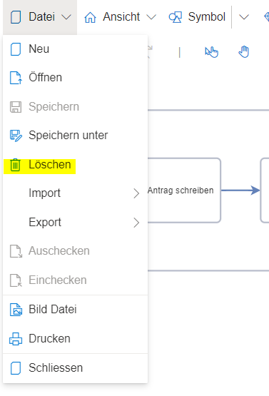

Um Modelldateien zu löschen, muss der Dialog über "Datei" --> "Löschen" geöffnet werden.

Es öffnet sich ein Dialog mit allen Modelldateien der Datenbank. Zum Löschen muss ein Eintrag selektiert und dann der "Löschen"-Button betätigt werden.
Dies ist jedoch mit Vorsicht zu tun; sind Dateien einmal gelöscht, können sie nicht mehr wiederhergestellt werden.

