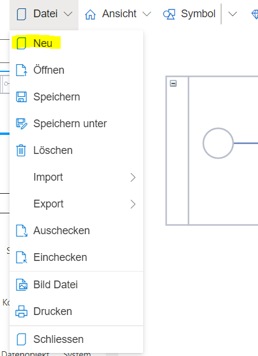
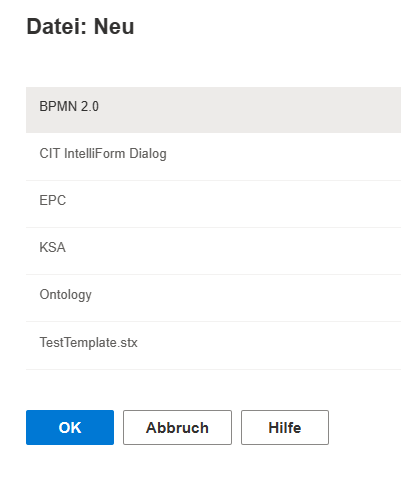

Neue Modelldateien können über den Menüeintrag "Datei" --> "Neu" erstellt werden.

Geöffnete Modelle sollten gespeichert werden, bevor ein neues Modell erstellt wird, um Datenverlust zu vermeiden.

Im geöffneten Dialog sind alle verfügbaren Notationen bzw. Vorlagen aufgelistet. Darunter können sich auch selbstdefinierte Vorlagen, welche von einer der (Standard) Notationen abgeleitet sind, befinden (hier: TestTemplate.stx). Durch Selektion eines Notationsnamens (grauer Balken) und Klick auf den "OK"-Button wird der Erstellungsvorgang abgeschlossen.

Wenn Sie mehr über das Arbeiten mit Ontologien wissen wollen, folgen Sie diesem Link [Arbeiten mit Ontologien](https://github.com/SemTalkOnline/SemTalkOnline_DE/wiki/Ontologien)!