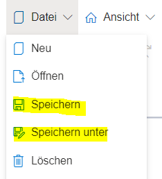
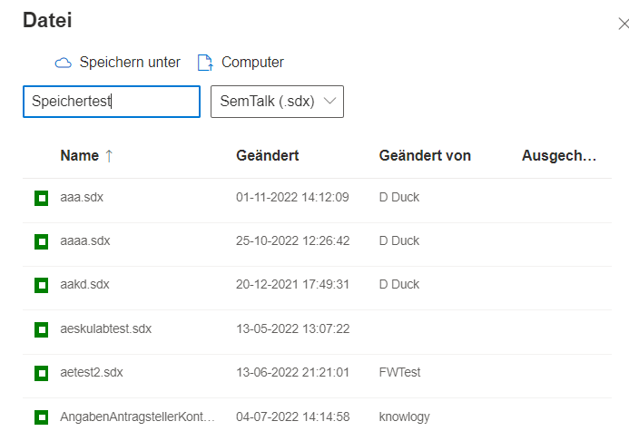

Um Modelldateien zu speichern, gibt es zum einen das Speichern-Icon in der Werkzeugleiste und zum anderen Einträge im Hauptmenüeintrag "Datei".

Grundsätzlich werden Dateien in der SemTalkOnline Datenbank gespeichert. Es ist jedoch auch möglich, Dateien lokal auf dem Rechner zu speichern und diese später dann auch von dort zu öffnen.

Das einfache "Speichern" speichert dabei die aktuell geöffnete Datei unter dem bereits gewählten Namen.

"Speichern Unter" öffnet einen Dialog, der es ermöglicht, einen Namen zu vergeben, den Computer als lokalen Speicherort zu wählen und die Dateiendung einzustellen. Existierende Dateien können aus der Liste selektiert und anschließend überschrieben werden. 2

## Dateiendungen

* SemTalk (.sdx): Standarddateiformat einer SemTalk Online Modelldatei.
* BPMN (.bpmn): Kann benutzt werden, um BPMN-Modelle im originalen BPMN-Format zu speichern
* Template (.stx): Speichert eine Datei als Modellierungstemplate. Wird z.B. ein BPMN-Modell angepasst (Farben, Schriftart und Dialogeinstellungen), kann dieses Modell als Template gespeichert werden und steht zukünftig unter "Datei" --> "Neu" zur Auswahl, wenn eine neue Modelldatei erstellt werden soll. 
Es sollte jedoch darauf geachtet werden, dass keine Modellierungselemente und andere Objekte in einer Template-Datei mitgespeichert werden.

