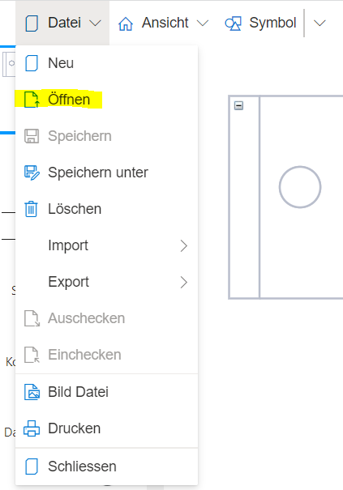

Über den Menüeintrag "Datei" --> "Öffnen" können bereits existierende Modelldateien geöffnet werden.
Vor dem Öffnen sollte ein sich aktuell in Bearbeitung befindliches Modell gespeichert werden, um Datenverlust zu vermeiden.

Der Dialog zeigt alle Modelldateien mit Namen, letztem Bearbeitungsdatum und letztem Bearbeiter sowie, ob die Datei aktuell ausgecheckt ist (verdeutlicht auch durch das rote Symbol), d.h. von einem anderen Modellierer bearbeitet wird.
Per Doppelklick kann eine ausgewählte Datei geöffnet werden. Alternativ kann die Datei selektiert und dann der "Öffnen"-Button verwendet werden.
Über den "Computer"-Button können Dateien geladen werden, die vorher lokal auf dem eigenen Computer abgelegt wurden.

