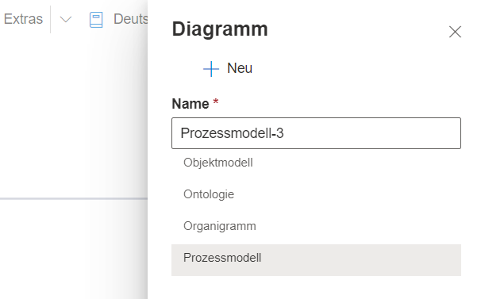
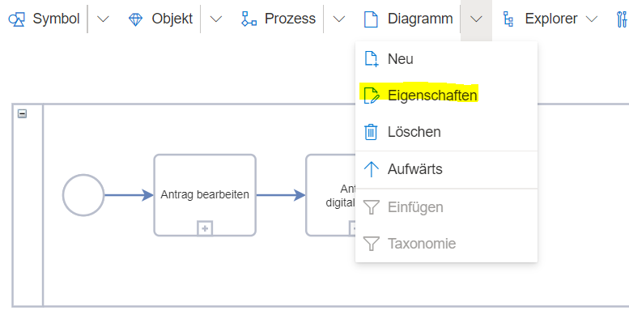
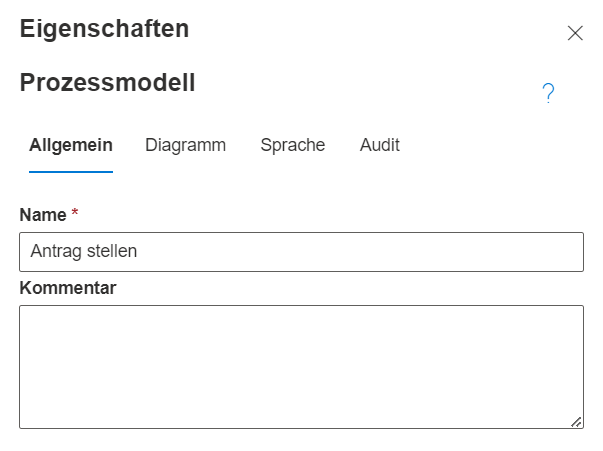
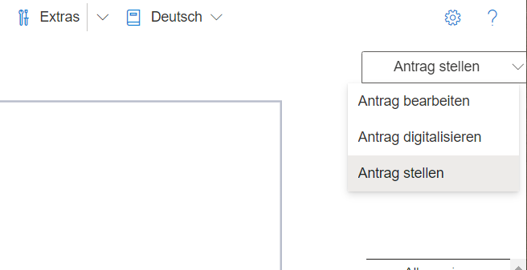
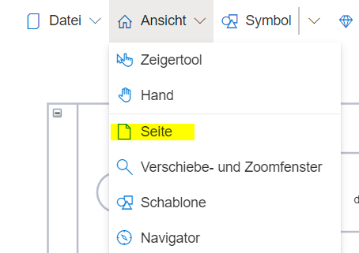

# Das Diagramm

Ein Diagramm ist die Arbeitsfläche für die Modellierung. Es kann auch als Zeichenblatt bezeichnet werden.
Das Diagramm enthält dabei ein in sich geschlossenes Modell entsprechend einer bestimmten Notation bzw. eines bestimmten Diagrammtyps.
Die prominentesten Beispiele für Notationen in SemTalk sind BPMN und EPK. Diese werden über "Datei" --> "Neu" beim Erstellen einer neuen Modelldatei ausgewählt. Jede Notation bringt ihre eigene Logik, Regeln, Shapes und Darstellungsarten mit, welche sich auch in den verschiedenen Diagrammtypen widerspiegeln.

BPMN Diagrammtypen:
* Objektmodell
* Ontologie
* Organigramm
* Prozessmodell

EPK Diagrammtypen:
* Business-Objekt Modell
* EPK (Ereignisgesteuerte Prozesskette)
* Informationsträgermodell
* Organigramm
* Sachmittelmodell
* Wertschöpfungskettendiagramm
* Wissenslandkarte

Innerhalb einer Modelldatei kann es mehrere Diagramme mit unterschiedlichen Diagrammtypen geben. Jedoch müssen diese alle zur selben Notation gehören. 

# Neue Diagramme anlegen

Über den Menüeintrag "Diagramm" --> "Neu" können der Modelldatei weitere Diagramme hinzugefügt werden.

SemTalk Online zeigt dann alle möglichen Diagrammtypen an. Per Mausklick kann einer dieser Typen ausgewählt und über den "Neu"-Button erstellt werden. Dabei ist es ratsam, auch immer gleich einen möglichst sprechenden Namen für das Diagramm zu wählen.

Das neue Diagramm steht nun zur Modellierung bereit.

# Diagrammseiten

Um alle existierenden Diagramme zu sehen, kann das Seiten-Tool benutzt werden. Dort sind alle Diagramme aufgelistet, und der Modellierer kann darüber die Diagramme wechseln.

Falls das Seiten-Tool nicht sichtbar ist, muss es über den Menüeintrag "Ansicht" --> "Seite" aktiviert werden.

# Diagramme bearbeiten

Auch Diagramme haben Eigenschaften, die von einem Administrator bearbeitet oder Informationen die angezeigt werden können.
Über den Menüeintrag "Diagramm" --> "Eigenschaften" lässt sich der Dialog öffnen.

Der Diagrammname kann dort geändert werden. Aber auch andere Attribute wie Übersetzungen des Diagrammnamens können angelegt werden. Des Weiteren können Audit-Informationen (wer hat das Diagramm angelegt oder bearbeitet) eingesehen werden.

