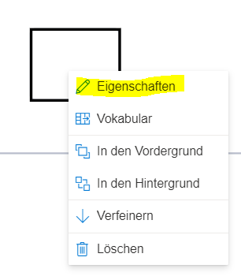
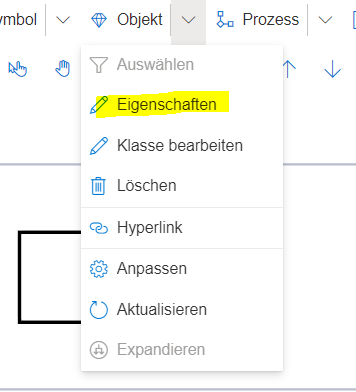
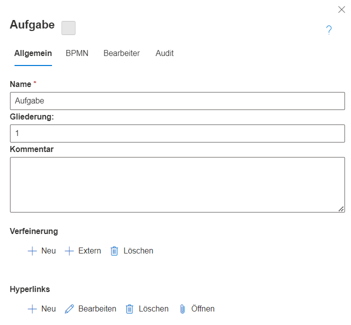
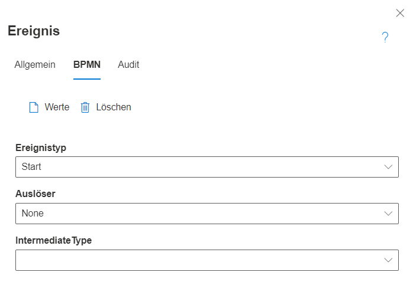

Alle Modellelemente in SemTalk Online haben Eigenschaften, mit denen sie näher beschrieben werden können.

# Den Eigenschaften Dialog öffnen

Es gibt zwei Möglichkeiten, den Eigenschaften Dialog zu öffnen:
* Rechtsklick auf ein Element --> "Eigenschaften"

* Ein Element selektieren --> Menüeintrag "Objekt" --> "Eigenschaften"

# Inhalt vom Eigenschaften Dialog

Grundsätzlich besteht der Dialog aus mehreren Tabs. Diese können sich jedoch je nach selektiertem Element unterscheiden.
**Der Tab "Allgemein"** ist allerdings immer vorhanden.
Er beinhaltet immer wenigstens ein Feld zur Benennung und ein Kommentarfeld. Elemente, die zu einem Prozessfluss gehören, haben außerdem noch eine Gliederungsnummer und, wenn es sich um Prozessaufgaben handelt, gibt es auch die Möglichkeit, Hyperlinks anzuhängen oder eine Verfeinerung zu erstellen. (Siehe Screenshot einer BPMN Aufgabe)

Für Hyperlinks (siehe [Wiki Seite: Hyperlinks](https://github.com/SemTalkOnline/SemTalkOnline_DE/wiki/Hyperlinks)) und Verfeinerungen (siehe [Wiki Seite: Verfeinerungen](https://github.com/SemTalkOnline/SemTalkOnline_DE/wiki/Verfeinerungen)) gibt es eigene Seiten in diesem Wiki.

Die weiteren Tabs des Eigenschaften-Dialogs hängen von Notation und Element ab. So haben in der BPMN alle Elemente des Prozessflusses (Ereignisse, Aufgaben, Gateways) einen BPMN-Tab, in welchem spezifische BPMN-Einstellungen getroffen werden können, z.B. Aufgaben- oder Ereignistypen, Auslöser und andere Eigenschaften.

**Bearbeiter** ist ein weiterer Tab, der oft angezeigt wird. In ihm lassen sich Bearbeiter des Prozessschrittes zuweisen. Wird in einer Swimlane modelliert, ist der Bearbeiter durch die Swimlane zugewiesen und wird im Bearbeiter-Tab mit angezeigt.

**Der Audit Tab** ist in der Regel ebenfalls eingeblendet. Er zeigt Meta-Informationen, wie Ersteller, letzter Bearbeiter und die dazugehörigen Datumsangaben an.

