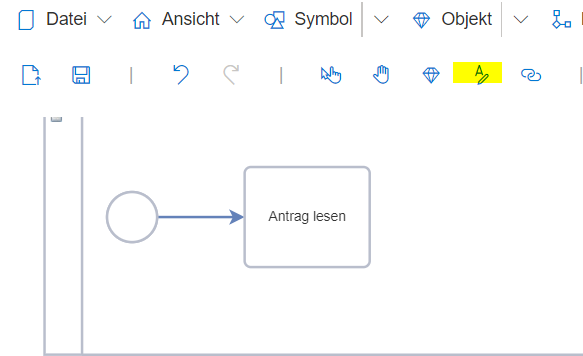
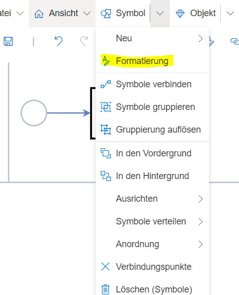
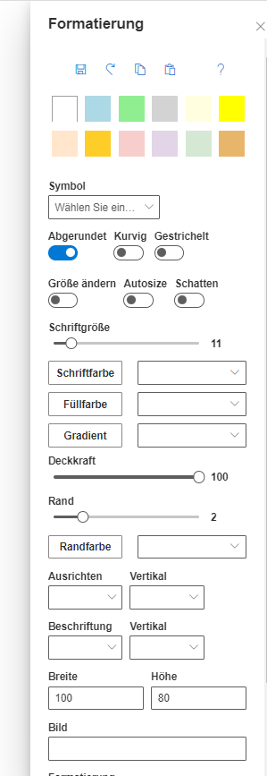

**Die Formatierungsfunktionalität** enthält Möglichkeiten, die einzelnen Shapes graphisch anzupassen und zu individualisieren.

Um den Formatierungsdialog zu öffnen, muss zuerst ein Shape selektiert werden. Anschließend kann entweder das Icon in der Werkzeugleiste oder der Eintrag im Menüpunkt "Symbol" --> "Formatierung" genutzt werden.

Für die Formatierung stehen zahlreiche Optionen zur Auswahl. Von der Symbolform, über Linienarten sowie Farbeinstellungen bis hin zu Textausrichtungen ist alles dabei.

