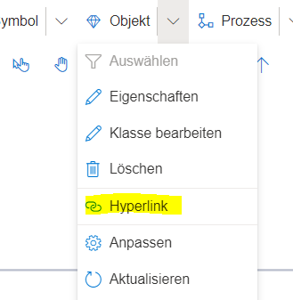
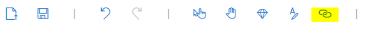
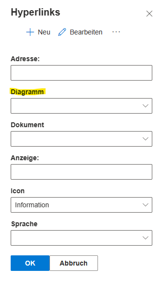
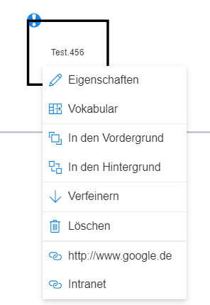

In SemTalk Online können die meisten Modellierungselemente Hyperlinks bekommen.
Ein Hyperlink ist dabei eine URL auf eine andere Webseite, ein Dokument, ein Verzeichnis oder auch eine andere Modelldatei. Um das Ziel des Hyperlinks auch öffnen zu können, muss dieses natürlich auch für alle Leser verfügbar sein.

Hyperlinks können entweder über den Eigenschaften-Dialog des Elements angelegt werden oder alternativ über den Menüeintrag "Objekt" --> "Hyperlink".

Auch in der Werkzeugleiste in ein Symbol zum Anfügen eines Hyperlinks vorhanden.

**Der Hyperlink Dialog** enthält Buttons zur Neuanlage, bzw. zum Bearbeiten, Löschen oder Öffnen eines Hyperlinks.
Zum Anlegen eines Hyperlinks gibt es einen Dialog mit sechs Feldern:
* Adresse:   Hier wird die URL eingetragen.
* Diagramm:  
Sofern das aktuelle Modell mehr als ein Diagramm bzw. Zeichenblatt beinhaltet, kann hier auf ein anderes Diagramm verwiesen werden. 
**Achtung:** Andernfalls wird dieses Feld im Dialog (hier gelb hervorgehoben) gar nicht angezeigt!
* Dokument:   Hier kann anstatt einer URL auch ein Dokument (repräsentiert durch eine *.sdx - Datei), also ein Modell aus der Modelldatenbank, ausgewählt werden, um dieses als Ziel des Hyperlinks zu nutzen. Wird dies nicht benötigt, kann das Feld leer gelassen werden.
* Anzeige:   Einem Hyperlink kann zur Anzeige ein sprechender Name hinzugefügt werden. Dieser wird für den Anwender später anstatt der eigentlichen URL sichtbar.
* Icon:  Hier kann aus einer Auswahlliste ein bestimmtes Icon ausgewählt werden, welches später das Objekt kennzeichnet, daß ein Hyperlink hinterlegt ist.
* Sprache:  Es kann eine Sprache gewählt werden, für welche der Hyperlink gilt, damit bei mehrsprachiger Modellierung auch unterschiedliche URLs, mit evtl. unterschiedlichen Sprachen, angezeigt werden können. Wird das Feld leer gelassen, ist der Hyperlink für alle Sprachen gültig.

Sind die Hyperlinks angefügt, können diese im Kontextmenü des Elements betrachtet werden. Im Beispiel wurde ein Link nur via URL (_Google_) angelegt und ein anderer mit URL und Anzeigename (_Intranet_). Dies spiegelt sich nun im Kontextmenü wider.

Das Info-Icon wird als Indikator dafür genutzt, dass ein Element einen Hyperlink hat, um dem Anwender das Finden von Hyperlinks zu erleichtern.
In den SemTalk-Optionen kann im Tab "Allgemein" die Checkbox "Hyperlinks durch Symbol anzeigen" aktiviert oder deaktiviert werden.

