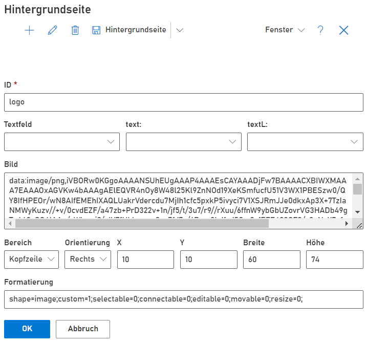

SemTalk Online erlaubt das individuelle Gestalten von Kopf- und Fußzeilen für Modelldateien und Modellseiten. In SemTalk Online wird dies zusammenfassend auch als Hintergrundseite bezeichnet.

## Hintergrundseiten einrichten

Das sich die Elemente eine Hintergrundseite an der Zeichenblattgröße orientieren, ist es notwendig Zeichenblattgröße sowie Ausrichtung einzustellen. 
Dafür siehe [Wiki Seite: Zeichenblattformat](https://github.com/SemTalkOnline/SemTalkOnline_DE/wiki/Zeichenblattformat)

Ist ein Zeichenblattformat definiert, kann die Anzeige der Hintergrundseite mit Kopf- und Fußzeile aktiviert werden. Dafür muss die Checkbox "Kopfzeile & Fußzeile" in dem SemTalk Optionen (Zahnrad rechts oben --> Ansicht) gesetzt werden.

SemTalk Online liefert eine Beispielhintergrundseite mit Diagrammname und SemTalk Logo in der Kopfzeile.

## Hintergrundseiten anpassen

Um eine Hintergrundseite auf individuelle Bedürfnisse anzupassen, gibt es einen Editor für Kopf- und Fußzeile. Dieser wird über den Menüpunkt Extras --> Anpassen --> Kopfzeile/Fußzeile aufgerufen.

Da es möglich sein soll verschiedenste Hintergrundseiten zu verwenden, werden beim Benutzer alle exisitierenden Hintergrundseiten angeboten. Dieser kann dann entscheiden welche der Seite bearbeitet bzw. auf die aktuelle Modelldatei angewendet werden soll.

Im geöffneten Dialog können die Elemente einer Hintergrundseite angelegt, bearbeitet und gelöscht werden. Ebenso können Hintergrundseiten exportiert, importiert und auf den Ausgangszustand zurückgesetzt werden.

### Bestandteile und Ändern einer Hintergrundseite

Eine Hintergrundseite besteht aus mehreren Anzeigefeldern, die dynamisch oder durch feste Vorgaben befüllt werden können. 
Vorhandene Felder werden im geöffneten Dialog tabellenartig aufgelistet.

Die wichtigsten Felder sind die Kopf- und Fußzeile (IDs pageHeader und pageFooter). Diese sind bereits vordefiniert und dürfen nicht gelöscht werden, da sie alle weiteren Elemente beinhalten. Sie dürfen jedoch bearbeitet werden um beispielsweise Größe oder Orientierung anzupassen.

Jedes Feld einer Hintergrundseite hat eine Reihe von Eigenschaften.
- ID: Ein eindeutiger Bezeichner des Feldes

Feldinhalt: (hier darf nur eins der Felder befüllt sein)
- Textfeld: Ermöglicht das Anzeigen von Informationen, die aus dem Modell bzw. einem Diagramm kommen, z.B. Dateiname, Diagrammname, Kommentar, Seitennummer oder Datumswerten. Ebenso lassen sich existierende Metadaten, die in den Dokumenteneigenschaften der Datei angelegt wurden verwenden.
- text und textL: Spracheinträge, die es in SemTalk Online gibt können genutzt werden um Felder mit Inhalt zu füllen, z.B. als Beschriftung von anderen Felder. Dies hat den Vorteil dass bei Nutzung dieser Einträge auch gleich eine Übersetzung in andere Sprachen integriert ist.
- Bild: Hier kann ein ein Base64 konvertiertes Bild eingetragen werden, welches dann im Feld angezeigt wird. 
Über einen Koverter wie https://base64.guru/converter/encode/image kann ein Bild in eine Base64 Zeichenfolge umgewandelt werden und dann in das Feld der Hintergrundseite eingefügt werden.

Formatierung:
- Bereich: Bestimmt ob das Feld in Kopf- oder Fußzeile angezeigt wird.
- Orientierung: Bestimmt wie das Feld innerhalb des Bereichs ausgerichtet wird.
- X und Y: Die detailierten Koordinaten auf denen die Felder angezeigt werden.
- Breite und Höhe: Höhe und Breite des Feldes
- Formatierung: Hier können weiteren Formatierungseigenschaften eingetragen werden, z.B. zur Schriftgröße, Schriftart, Farbe etc.

Der Editierdialog kann entweder über das Markieren eines bestehenden Eintrages und dann durch klick auf das Schift-Icon im Menü aufgerufen werden oder durch den + Button um einen neuen Eintrag zu erzeugen.

### Übernehmen einer Hintergrundseite für eine Datei

Die Änderungen an einer Hintergrundseite werden direkt auf dem Zeichenblatt angezeigt. Dies ist jedoch nur eine Einstellung in der eigenen Modellierumgebung. Soll die Hintergrundseite für alle Nutzer gelten, die die Datei öffnen, muss im Menüeintrag "Hintergrundseite" einmal "Für Datei übernehmen" durchgeführt werden. Die konfigurierte Hintergrundseite wird dann in die Datei geschrieben und ist für diese fest eingestellt.

Im gleichen Menüeintrag lässt sich die Hintergrundseite auch im JSON Format importieren oder exportieren sowie auf den Auslieferungszustand zurücksetzen.

### Beispiel für eine Hintergrundseite

Da das Erstellen und Konfigurieren einer Hintergrundseite eine relative komplexe Aufgabe sein kann, kann es notwendig sein ein wenig rumzuprobieren bis das gewünschte Ergebnis erreicht wird.

An dieser Stelle wird zur Unterstüzung ein kleines Beispiel gegen, wie verschiedene Felder zusammenwirken und platziert werden können.

Ziel soll folgende Hintergrundseite sein:

Im Ansicht Tab der Optionen ist A4 und Querformat eingestellt.
Die Kopfzeile bleibt in der Auslieferkonfiguration mit Diagrammname und Logo in der rechten Ecken.
Für die Fußzeile wird die Seitennummer mit beschreibenem Feld eingefügt, das letzte Änderungsdatum und ein Kommentar zum Diagramm.

1. Grundlage sind immer die Einträge mit der ID pageHeader und pageFooter. Diese sind die Container für alle anderen Felder.
2. Die Fußzeile soll kleiner sein als die Kopfzeile. Daher wird die Zeile mit der ID pageFooter markiert und der Stift Button zum editieren gedrückt. Im Feld Höhe wird der Wert auf 40 geändert und mit OK bestätigt.
3. Es wird ein Feld mit der Beschriftung "Seite" eingefügt. Dafür wird ein neuer Eintrag über "+" angelegt, eine beliebige aber einzigartige ID vergeben und die Position eingestellt. Da das Feld in der Fußzeile links oben sein soll wird auf Fußzeile mit der Orientierung Links eingestellt. 
Die Felder X und Y könne benutzt werden um exakte Positionierung auf Pixelebene innerhalb der Fußzeile vorzunehmen. Im Falle dieses Feldes sind die Werte 0 und 0. Die Breite sollte je nach Textlänge passend gewählt werden. Im Beispiel sind es 100. Die Höhe wird passend zur Fußzeile auf 40 festgesetzt.
Als Text für das Feld soll das Wort "Seite" fest eingestellt werden. Dafür kann entweder direkt in das Feld text geschrieben werden oder wie im Beispiel aus der Auswahlliste der Textwert "Seite" ausgewählt werden. Dieser existiert bereits in SemTalk Online und ist daher auch mehrsprachig vorhanden und lässt sich auch für die Hintergrundseite wiederverwenden. (Im Feld steht danach die interne Bezeichnung dafür)
Das Anlegen wird mit OK abgeschlossen.

4. Nun soll die eigentliche Seitennummer eingefügt werden. Es wird wieder ein neuer Eintrag erzeugt und wie auch in Schritt 3 die Positon eingestellt. Diesmal wird jedoch die X Koordinate auf 100 gesetzt, da das erste Feld eine Breite von 100 Pixeln hatte und das neue Feld direkt dahinter platziert werden soll. Bei der Breite vom neuen Feld wird diesmal nur 50 eingestellt, da die Seitennummer weniger Platz benötigt. 
Um die Seitennummer des jeweiligen Diagramms zu bekommen muss im Auswahlfeld Textfeld "Diagramm: Gliederung" gewählt werden. (falls das nicht vorhanden ist, sind die Seiten noch nicht nummeriert. Kann über den Hauotmenüpunkt Diagramm --> Indizierung nachgeholt werden)
Auch im Textfeld wird der interne Bezeichner stehen. In der Auswahlbox sieht es wie folgt aus:

Die 3 markierten Einträge sind diejenigen die für Schritt 4, 5 und 6 gewählt werden müssen.

Mit OK wird der Vorgang abgeschlossen.

5. Das letzte Änderungsdatum wird analog angelegt. Die X Koordinate muss diesmal auf 150 gesetzt werden, da die beiden vorherigen Felder zusammen auf die Breite von 150 kommen und als Breite kann diesmal wieder 100 gewählt werden. Im Textfeld wird "Document: Geändert" aus gewählt.

Mit OK wird der Vorgang wieder abgeschlossen.

6. Das letzte Feld soll einen Kommentar aus den Eigenschaften des Diagramms beinhalten. Es wird daher "Diagramm: Kommentar" ausgewählt. Die X Koordinate muss auf 250 gesetzt werden und die länge wird diesmal auf 800 festgelegt damit ein Satz in das Feld passt.

Nun ist die Hintergrundseite fertig. 
Das Beispiel kann als [als JSON Datei](./Support/HintergrundseiteBeispiel.json) abgerufen werden und im Kopf- und Fußzeilen Dialog importiert werden.

Als Trick für die Positionierung empfiehlt es sich während der Erstellung mit Rändern zu arbeiten. So kann im Feld Formattierung das Attribut strokeColor auf schwarz gesetzt werden (strokeColor=black;) um einen schwarzen Rand um das Feld zu bekommen. Das kann hilfreich sein während einzelne Felder angeordnet werden, um die genaue Größe und Position auch auf dem Zeichenblatt zu sehen. Am Ende der Arbeit kann der Rand dann wieder entfernt werden.

