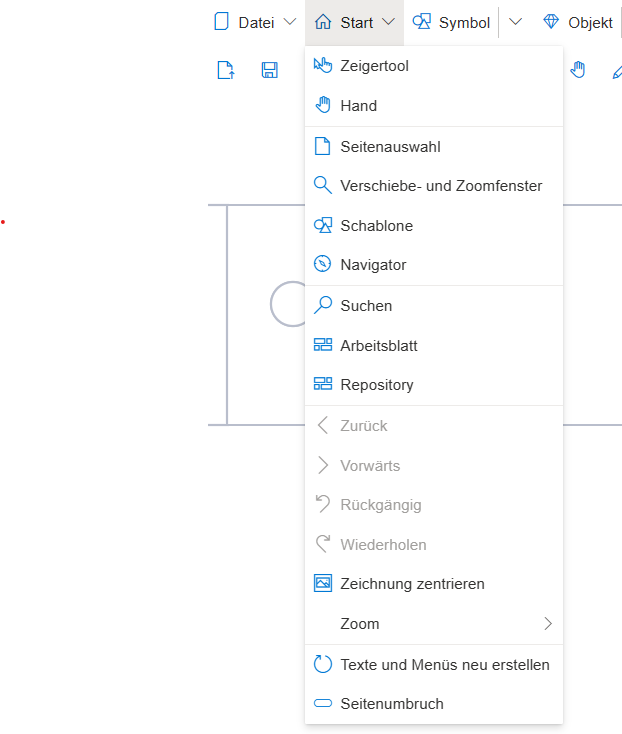

**Menüpunkt: Start**:  Das Start-Menü enthält Funktionalitäten, um die Oberfläche und die Modellelemente graphisch und funktional anzupassen: 
* Mausmodus ändern (Hand, Zeigertool), 
* Einblenden/Ausblenden von Funktionstools (Seitenauswahl, Verschiebe- und Zoomfenster, Schablone, Navigator), 
* Übersichts- und Bearbeitungswerkzeuge (Suchen, Arbeitsblatt, Repository)
* Navigieren in Geschäftsprozessen (Zurück, Vorwärts)
* Aktionen verändern (Rückgängig machen/Wiederholen)
* Zeichnung zentrieren
* Zoom-Einstellungen
* Texte und Menüs neu erstellen/zeichnen
* Seitenumbruch anzeigen

