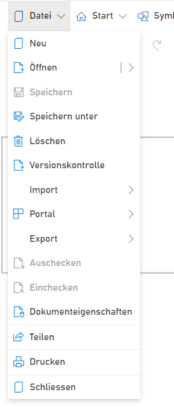

**Menüeintrag Datei**: Im Dateimenü befinden sich alle Einträge, die zu den grundlegenden Aktionen mit einer Modelldatei gehören.

* **Neu**: Neue Dateien anlegen. Detailliertere Informationen sind hier zu finden: [Wiki Seite: Datei Neu](https://github.com/SemTalkOnline/SemTalkOnline_DE/wiki/Datei-Neu)

* **Öffnen**: Existierende Datei öffnen. Detailliertere Informationen sind hier zu finden: [Wiki Seite: Datei Öffnen](https://github.com/SemTalkOnline/SemTalkOnline_DE/wiki/Datei-%C3%96ffnen)

* **Speichern oder Speichern unter**: Dateien abspeichern. Detailliertere Informationen sind hier zu finden: [Wiki Seite: Datei Öffnen](https://github.com/SemTalkOnline/SemTalkOnline_DE/wiki/Datei-%C3%96ffnen)

* **Löschen**: Öffnet ein Menü zum Löschen von Modelldateien. 

* **Versionskontrolle**: SemTalk Online speichert mindestens 5 (je nach Konfiguration auch mehr) alte Versionen der Modelldateien. Immer wenn eine Datei gespeichert wird, wird die alte Version in der Versionskontrolle hinterlegt. Somit können  alte Versionen schnell wiederhergestellt werden. [Wiki Seite: Versionskontrolle](https://github.com/SemTalkOnline/SemTalkOnline_DE/wiki/Versionskontrolle)

* **Import**: SemTalk Online bietet verschiedenste Möglichkeiten zum Importieren von Modelldateien. Detailliertere Informationen sind hier zu finden: [Wiki Seite: Datei Öffnen](https://github.com/SemTalkOnline/SemTalkOnline_DE/wiki/Datei-%C3%96ffnen)

* **Portal**: Für Administratoren und Publikatoren steht die Funktionalität zum Veröffentlichen der Modelle in einem Prozessportal zur Verfügung. Wenn es aktiviert ist lässt sich auch ein mehrstufiger Publikationsprozess mittels einer Veröffentlichungsdatenbank abbilden. [Wiki Seite: Modelle veröffentlichen](https://github.com/SemTalkOnline/SemTalkOnline_DE/wiki/Modelle-veröffentlichen)

* **Export**: SemTalk Online bietet verschiedenste Möglichkeiten zum Exportieren von Modelldateien. Detailliertere Informationen sind hier zu finden: [Wiki Seite: Datei Öffnen](https://github.com/SemTalkOnline/SemTalkOnline_DE/wiki/Datei-%C3%96ffnen)

* **Auschecken / Einchecken**:  Benutzer können geöffnete Dateien auschecken und somit für die Bearbeitung durch andere Benutzer sperren. Um die Datei wieder freizugeben muss diese wieder eingecheckt werden. Im Datei Öffnen Dialog sind ausgecheckte  Dateien mit einem roten Icon versehen und eingecheckt mit einem grünen.

* **Dokumenteigenschaften**: Benutzer können in einem weiteren Dialog frei wählbar Eigenschaften für ein Dokument definieren.

* **Teilen**: Benutzer können über diese Funktion ein Modell mit anderen teilen. Der Dialog, der sich dann öffnet, erlaubt das Teilen via 
einer email-Adresse

* **Drucken**: Öffnet das aktive Diagramm in einer Druckansicht.

* **Schließen**: Schließt die Modelldatei.
