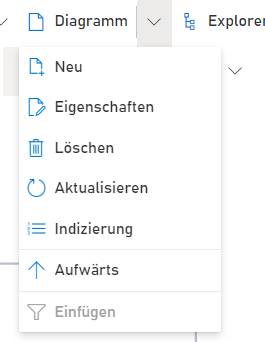

**Menüeintrag Diagramm:** Hier dreht sich alles um einzelne Diagramme. Anlegen und Ändern von Diagrammseiten ist über diesen Menüeintrag möglich.

Um mehr zu Diagrammen zu erfahren, folgen Sie folgendem Link:
[Wiki Seite: Diagramme](https://github.com/SemTalkOnline/SemTalkOnline_DE/wiki/Diagramme)
