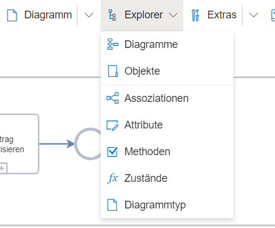

Der Menüeintrag "Explorer" gibt dem Benutzer die Möglichkeit, detaillierter in die Logik und Inhalte des Modells zu schauen, die über das Sichtbare auf dem Zeichenblatt hinausgehen.

Menüpunkte:
* Diagramme
* Objekte
* Assoziationen
* Attribute
* Methoden
* Zustände
* Diagrammtyp

Allerdings ist für alle Menüpunkte, bis auf Diagramme und Objekte, eine Administratorrolle notwendig, da diese Menüs genutzt werden können, um das Metamodell und die Funktionsweise der jeweiligen Notation anzupassen.

Zu all diesen Menüpunkten sind weiterführende Seiten in diesem Wiki-Tutorial zu finden.

