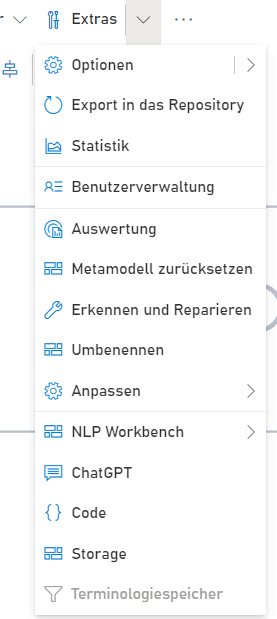

**Menüeintrag Extras:** Hier gibt es zahlreiche Zusatzfunktionalitäten, die für die normale Modellierung in der Regel nicht benötigt werden. Für fortgeschrittene Nutzer stellen diese Funktionalitäten jedoch hilfreiche Mittel dar, um die Modelllandschaft aufzuwerten.

