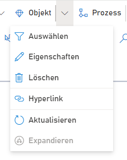

### Arbeiten mit Objekten

Hier finden sich Funktionalitäten, die auf einzelne SemTalk Objekte angewendet werden können. 
Daunter fällt der Eigenschaften Dialog, das Hinzufügen von Hyperlinks, Auswählen bestehender Objekte (Zwecks Mehrfachverwendung), Bearbeiten und Anpassen der Dialoge und das Löschen von Objekten.

