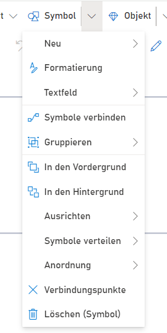

**Der Menüeintrag "Symbol"** enthält Funktionalitäten zum Bearbeiten der Darstellungsweise der Shapes.
 

Grundsätzlich ist es notwendig, zuerst ein Shape zu selektieren, bevor die Funktionalitäten des Symbol-Menüs genutzt werden können.

**Neu**: Das Neu-Menü schlägt verfügbare Shapes vor, die im Prozessablauf zum selektierten Shape passen. Durch Anklicken eines dieser Vorschläge wird automatisch ein Shape auf dem Zeichenblatt angelegt und mit dem selektierten Shape verbunden.

**Formatierung**: Öffnet den Formatierungsdialog zum Ändern des Aussehens des selektierten Shapes. Siehe [Formatierung](https://github.com/SemTalkOnline/SemTalkOnline_DE/wiki/Formatierung)

**Symbole verbinden**: Es können zwei oder mehr Shapes selektiert werden. "Symbole verbinden" zieht dann automatisch Verbinder zwischen den Shapes.

**Symbole gruppieren/Gruppierung auflösen**: Elemente auf dem Zeichenblatt können zu Gruppen zusammengefasst werden.

**In den Vordergrund/ In den Hintergrund**: Elemente können in ihrer Ebene verschoben werden, so dass bei eventuellen graphischen Überlappungen von Symbolen ausgewählt werden kann, welches Symbol im Vordergrund angezeigt wird.

**Ausrichten/ Symbole verteilen/ Anordnung**: Diese Funktionalitäten können dabei helfen, eine Vielzahl von selektierten Shapes einfacher auszurichten und das Prozessmodell zu strukturieren.

**Verbindungspunkte**: Macht die Verbindungspunkte an den Shapes sichtbar.

**Löschen (Symbole)**: Löscht das ausgewählte Symbol vom Zeichenblatt.

