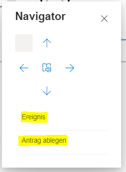

Mit dem Navigatortool kann ein Benutzer durch die Prozessstrukturen navigieren. Das Tool wird
über den Menüeintrag "Start" --> "Navigator" geöffnet.

  Das Tool bietet dem Benutzer Navigationspfeile an, um Schritt für Schritt durch einen Prozessablauf zu gehen.  

 
Der dargestellte BPMN-Prozess diene als Beispiel. 

 
Wird das Startereignis selektiert, kann mit dem Pfeil nach rechts dem Prozessfluss gefolgt werden. Mit dem Pfeil nach links geht es einen Schritt zurück. 
 
Am Gateway kann der Benutzer entscheiden, welchem Prozesszweig gefolgt werden soll (dem Ereignis oder "Antrag ablegen").  
)
 
Mit dem Pfeil nach unten springt man in eine Verfeinerung, natürlich nur dann, wenn das aktuell selektierte Element eine solche besitzt. In einer Verfeinerung kann dann ebenfalls wieder der Prozessverlauf verfolgt werden. Mit dem Pfeil nach oben springt das Navigatortool wieder eine Stufe nach oben auf den übergeordneten Prozess.

Der Button in der Mitte liest den Namen des selektierten Elements vor.
