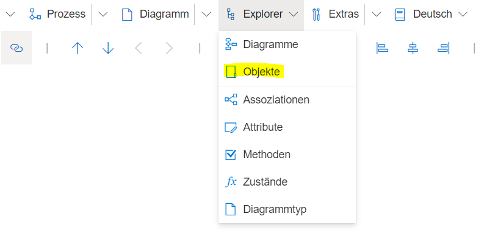
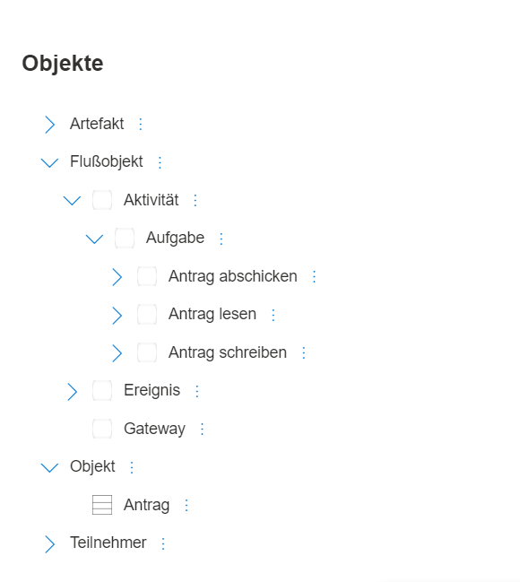

Im Menüeintrag "Explorer" --> "Objekte" ist der Objekt-Explorer zu finden.

Der Objekt-Explorer zeigt alle Modellierungsobjekte an, die im aktuell geöffneten Modell, dem Metamodell entsprechend eingeordnet, angelegt sind.
Um diese Funktionalität nutzen zu können, wird ein Benutzer mit mindestens **Editorberechtigung** benötigt.

Alle Objekte und Klassen können über den Objekt-Explorer bearbeitet und angepasst werden. (3-Punkte-Menü)

Haben Elemente ein rechteckiges graues Icon, ist dieses Element als Modellierungsinstanz auf dem Zeichenblatt angelegt und kann mittels des 3-Punkte-Menüs --> "Gehe Zu" auf dem Zeichenblatt hervorgehoben werden.

