# Einführung
SemTalkOnline erlaubt es dem Anwender, Wissensmodelle in Form von Ontologien zu erstellen. Dazu muß der Anwender bei der Neuanlage eines Modells die Ontologie-Vorlage auswählen. Ontologien können einerseits für sich alleinstehend modelliert werden, oder aber mit bestehenden Geschäftsprozessmodellen verknüpft werden. Auf diese Möglichkeiten wird auch weiter unten im Abschnitt "Neuanlage von Ontologien" eingegangen.
## Darstellung
Zunächst unterscheidet SemTalkOnline zwei Darstellungsarten bezüglich Klassen in Ontologien (vgl. nachstehende Abbildung). Hier sind Klassen als
weiße Ellipsen dargestellt, während Instanzen durch graue Ellipsen dargestellt werden. 

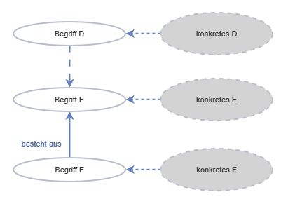

Klassen in Ontologien können aber auch in Anlehnung an den UML-Standard als Rechtecke dargestellt werden, wobei dann auch die Möglichkeit besteht, außer dem Klassennamen auch die zugehörigen Methodennamen zu sehen.

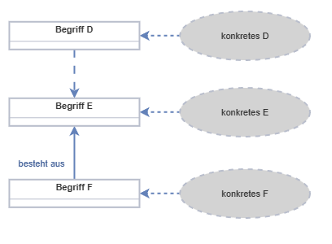

Um diese Darstellungsform (UML-Notation) zu erhalten, muß in den allgemeinen Optionen das Häkchen bei "UML Klasen Shape in Ontologien" gesetzt sein.

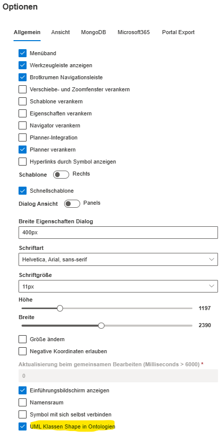

**Hinweis:** Die Standardfarbgebung kann jederzeit durch den Anwender geändert werden.

# Neuanlage von Ontologien
## Ontologiemodell neu erstellen
Zum Erstellen eines neuen Ontologiemodells wählt man zunächst die Funktion "Datei -> Neu" aus dem Hauptmenü aus

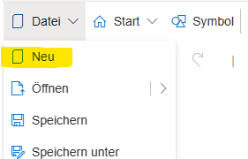

In dem dann erscheinenden Dialog muß die Vorlage "Ontology" ausgewählt und mit "OK" bestätigt werden.

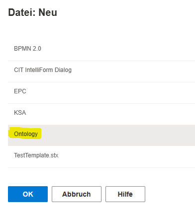

SemTalkOnline stellt dann dem Anwender die passende Schablone mit Shapes zur Verfügung, um Ontologien zu modellieren (vgl. Arbeiten mit Ontologien).
Zu beachten ist noch, daß in einem Ontologiemodell als weitere Diagramme/Zeichenblätter nur Ontologien erstellt werden können. Anders ist das bei Geschäftsprozessmodellen. In diesen können auch Ontologien als weitere Diagramme neben Geschäftsprozessen aufgenommen werden.
## Ontologiemodell in Zusammenhang mit Geschäftsprozessmodellen neu erstellen
Um weiteres Wissen zu einem Geschäftsprozess integriert bereitzustellen, bietet SemTalkOnline dem Anwender die Möglichkeit, zu einem bestehenden Geschäftsprozesmodell in einem weiteren Diagramm bzw. auf einem neuen Zeichenblatt eine Ontologie zu erstellen. Dazu wählt man im Hauptmenü die Funktion
"Diagramm -> Neu" aus.

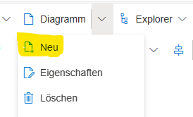

Im anschließenden Dialog wählt man zunächst die Vorlage "Ontologie" aus. SemTalkOnline reagiert darauf sofort und schlägt im obersten Eingabefeld "Name" den Namen "Ontologie-1" vor. Der Anwender kann dann das Ontologie-Diagramm mit einem neuen Namen versehen, bevor der Dialog mit "OK" abgeschlossen wird.

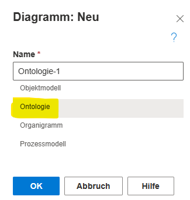

# Arbeiten mit Ontologien
## Schablone
Durch die Wahl einer Ontologie als Modell-Vorlage wird auch die Art der Schablone bestimmt, mit Hilfe derer SemTalkOnline dem Anwender Shapes zum Modellieren zur Verfügung stellt. 

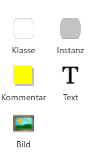

Per Drag&Drop können die Shapes nun auf die Zeichenfläche bzw. in das Diagramm gezogen werden. 
Als Editor sieht ein Anwender folgende Shapes
* Klasse
* Instanz
* Kommentar
* Text
* Bild

## Die QuickShapes
SemTalkOnline bietet dem Anwender darüberhinaus die Möglichkeit, direkt an bestehenden Shapes weitere Modellierungen vorzunehmen. Dazu kann der Anwender per "MouseOver" an einem existierenden Shape die so genannten "QuickShape" aufrufen

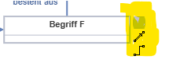

Aus den QuickShapes können diese Modellierelemente ausgewählt werden
* Instanz (grauer Kasten)  
Damit wird eine Instanz der betreffenden Klasse erzeugt
* Oberklasse (Pfeil) 
Damit wird die Beziehung der Klasse zu einer Oberklasse hergestellt
* Relation (gewinkelte Linie) 
Damit wird eine Beziehung zwischen zwei Klassen hergestellt

## Ein- und Ausblenden von Attributen
SemTalkOnline ermöglicht die Anzeige der Klassenattribute in Ontologien, sofern Attribute definiert worden sind. Dazu ist es aber erforderlich,
zunächst die Darstellungsart "UML-Klassen Shape" in den Optionen einzustellen. 

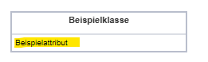

Der Anwender kann dann per rechter Maustaste auf einer Klasse das Kontextmenü aufrufen, in welchem der Eintrag "Attribute" vorhanden ist. Durch Klick auf "Attribute" können dann die Attributnamen zu einer Klasse ein- bzw. wieder ausgeblendet werden.

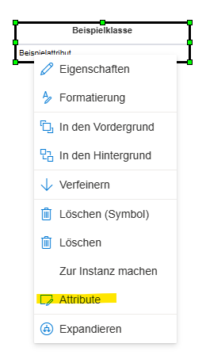

## Wechsel zwischen Klassen und Instanzen
SemTalkOnline bietet die Möglichkeit, in einer Ontologie zwischen Klassen und Instanzen hin und her zu wechseln.
Startet man mit einer Klasse, so kann man im Kontextmenü die Funktion "Zur Instanz machen" aufrufen.

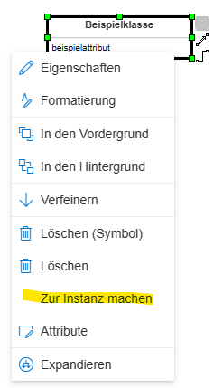

Als Ergebnis ist nun die Klasse in eine Instanz (graues Oval) verwandelt worden, die denselben Namen von der Klasse übernommen hat.

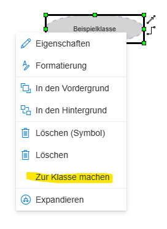

Durch erneutes Aufrufen des Kontextmenüs kann man aus der Instanz wieder eine Klasse machen, in dem man die Funktion "Zur Klasse machen" aufruft.

Sollte die Klasse bereits ein oder mehrere Attribute besitzen, so werden diese Attribute beibehalten

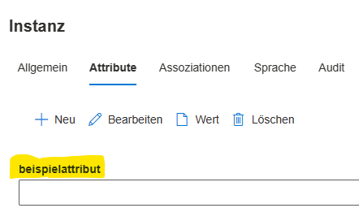

## Relationen
Um eine Beziehung zwischen zwei Klassen in einer Ontologie herzustellen, nutzt man das QuickShape "gewinkelte Linie" (vgl. Abschnitt über QuickShapes,oben). Dazu aktiviert man das QuickShape "Relation" an der Klasse, von der die Relation ausgehen soll, und "zieht" den dann erscheinenden Pfeil zur Klasse, zu der die Relation gebildet werden soll. SemTalkOnline benennt dann die Relation zunächst so, wie der Default eingestellt ist
(Im Beispiel "besteht aus")

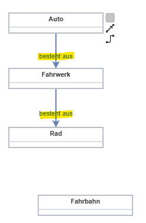

Ein Auto besteht also u.a. aus dem Fahrwerk, das wiederum u.a. aus Rädern besteht. Will man nun ausdrücken, daß die Räder den Kontakt zur Fahrbahnherstellen, muß die nun durch eine andere Relation (etwa "hat Kontakt mit") ausgedrückt werden. Dazu stellt man zuerst grundsätzlich eine Relation zwischen einem "Rad" und der "Fahrbahn" her, 

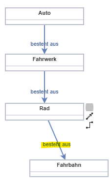

muß dann aber noch den Namen der Relation ändern. Dazu klickt man die Relation doppelt an und kann dann den Namen der Relation ändern.

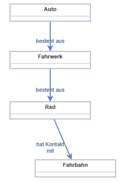

SemTalkOnline legt dabei die neue Relation im Modell ab, was der Anwender im Explorer (-> Objekte) leicht überprüfen kann (vgl. Screenshot).
Hier sieht man alle Relationen (Karteireiter "Assoziationen"), die mit der Klasse "Rad" verknüpft sind. Die weitere Relation "hat Kontakt mit" ist
gelb hervorgehoben.

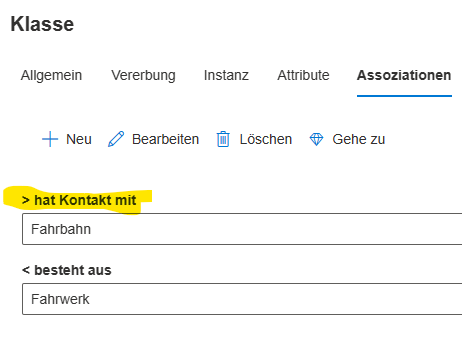

**Hinweis:** Relationen sind gerichtet, was man an den Winkeln vor dem Relationsnamen im Karteireiter erkennen kann. In der graphischen Darstellung sind Relationen als Pfeil mit einer Richtung dargestellt.

# Verknüpfung von Ontologien mit Geschäftsprozessmodellen
## Allgemeine Bemerkungen
SemTalk Online ermöglicht es, zusätzliches Wissen über Objekte, mit denen im Rahmen von Geschäftsprozessen umgegangen wird, in Form von Ontologien abzuspeichern. Voraussetzung dafür ist allerdings, daß die Objekte in einem Geschäftsprozess vorher mit der Vokabular-Funktion in der Datenbank abgelegt wurden. Man kann das prüfen, in dem man eine Aufgabe in einem Geschäftsprozess auswählt und dann darauf die Vokabular-Funktion anwendet. Sind die Felder des dann erscheinenden Dialogs befüllt, sind Objekt (und Methode) korrekt separat in der Datenbank abgelegt worden. Sind die diesbezüglichen Felder leer, so gibt es keine entsprechenden Einträge für Objekt bzw. Methode.  
Öffnet man den Objekt-Explorer, so findet man dann auch keine Einträge.  
**Hinweis:**  
Die Aufgabe gibt es natürlich schon, ist aber an anderer Stelle im Objekt-Explorer zu finden, nämlich wenn man den Explorer in dieser
Reihenfolge expandiert: "Flußobjekt" -> "Aktivität" -> "Aufgabe" ->  
## Auswahl eines existierenden Objekts zur Referenzierung in einer Ontologie
Stellen Sie zunächst sicher, daß das aktuelle Zeichenblatt/Diagramm zu einer Ontologie gehört. Klicken Sie dann mit der rechten Maustaste irgendwo an einer freien Stelle auf das Zeichenblatt. In dem erscheinenden Kontextmenü wählen die die Funktion "Einfügen"

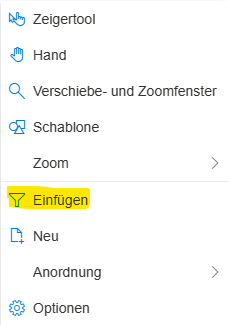

Danach erscheint ein umfangreicher Auswahldialog, aus dem Sie die gewünschten Objekte durch Setzen von Häkchen auswählen

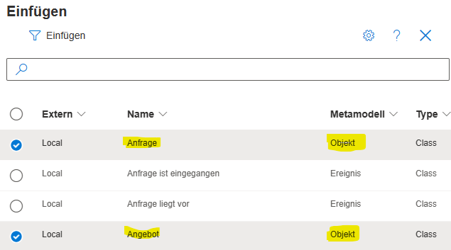

**Hinweis:** 
Es ist auch möglich, die Auswahlliste nur auf Objekte einzuschränken. Dazu muß man den Filter der Spalte "Metamodell" auf "Objekt" setzen.
  
Schließlich werden durch Klick auf "Einfügen" (oben links im Dialog) die ausgewählten Objekte in der Ontologie sichtbar.

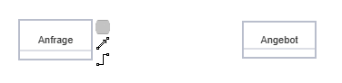
