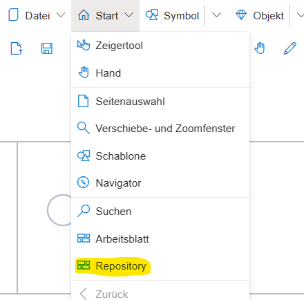
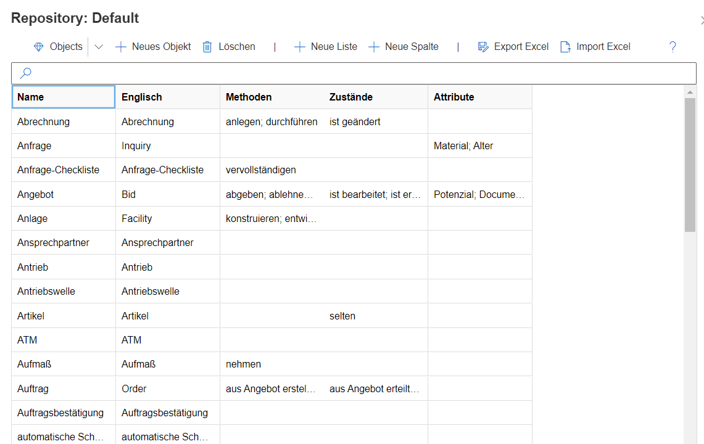
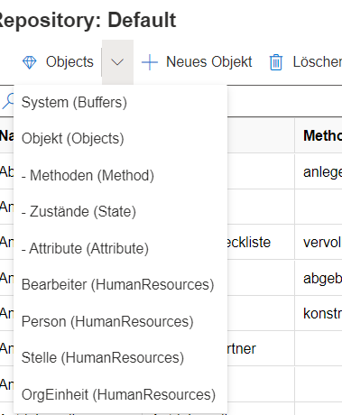
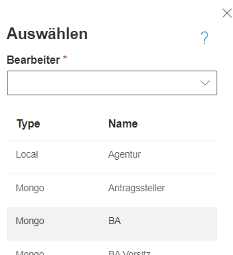
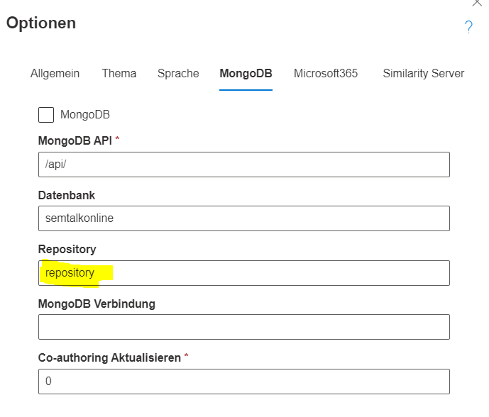

Das Repository ist eine Datenbank, in der alle SemTalk-Objekte, -Methoden, -Zustände, -Attribute, -Bearbeiter zentral abgelegt werden und somit Modelldatei-übergreifend genutzt werden können.

Objekte aus dem Repository können über den "Auswählen"-Eintrag im Kontextmenü verschiedenster Modellierungselemente benutzt werden. Dies gilt z.B. für Bearbeiter oder Datenobjekte.
Für das Vokabular gilt dasselbe. Hier werden alle Objekte vorgeschlagen und dazu die jeweils existierenden Methoden oder Zustände angeboten.
Ist im Repository eine Übersetzung eingepflegt, wird diese ebenfalls mit angezogen. Auf diese Weise können mehrsprachige Modelle schnell erstellt und die Arbeit auch auf andere Modelldateien übertragen werden.

# Das Repository Fenster
Geöffnet wird das Repository über den Menüeintrag "Start" --> "Repository"

Der so geöffnete Dialog zeigt alle existierenden Objekte.

Über das Auswahlfeld in der linken oberen Ecke (Diamant-Symbol) kann die Art der angezeigten Repository-Elemente ausgewählt werden. "Objekte" ist voreingestellt, aber auch Bearbeiter, Systeme, Methoden, Zustände können dargestellt und geändert werden.

Weitere Funktionalitäten:
* Neues Objekt: So können neue Objekte in das Repository eingepflegt werden.
* Löschen: Objekte können aus dem Repository entfernt werden. Es ist zu beachten, dass das Löschen eines Objektes aus dem Repository dieses Objekt nicht aus den Modelldateien löscht. Diese speichern eine lokale Kopie des Objektes, damit die Modelle nicht durch Änderungen am Repository beschädigt werden können.  
**Achtung:** Diese Funktion ist nur für Anwender mit Administrator-Rechten aktiv.
* Neue Liste: Dem Repository kann auch eine weitere Liste hinzugefügt werden.... 
**Achtung:** Diese Funktion ist nur für Anwender mit Administrator-Rechten aktiv.
* Neue Spalte: Den Objekten kann eine weitere Spalte hinzugefügt werden, die ergänzende Inhalte enthält. 
**Achtung:** Diese Funktion ist nur für Anwender mit Administrator-Rechten aktiv.
* Export Excel/ Import Excel: Das Repository kann nach Excel ausgeleitet werden und so u.a. auch zwischen Datenbanken ausgetauscht werden. Ein weiterer Anwendungsfall wäre das Pflegen aller Objekte außerhalb von SemTalk-Online in Excel und danach der Import eines solchen Repositories in die Modelldatenbank.

# Mit Repository modellieren

Für alle Modellelemente, die die Repositorybegriffe verwenden können, gibt es den Auswählen-Dialog. Dieser findet sich im Kontextmenü (Rechtsklick auf ein Element). So führt der Auswählen-Dialog einer Swimlane zur Liste der Bearbeiter oder der eines Systems zur Liste der Systeme. Aus der geöffneten Liste kann dann ein Element ausgewählt werden. Die Spalte "Type" gibt an, ob das Element lokal (Local) aus dem Modell stammt, oder ob es aus dem MongoDB-Repository (Mongo) kommt.

Für Aufgaben in der EPK oder BPMN-Notation gibt es die Vokabularfunktionalität. Diese setzt ebenfalls auf die Begriffe des Repositories.
Näheres dazu kann unter der [Wiki Seite: Vokabular](https://github.com/SemTalkOnline/SemTalkOnline_DE/wiki/Vokabular) nachgelesen werden.

# Repository konfigurieren
Eingebunden wird ein Repository mit Hilfe der SemTalk-Optionen im MongoDB-Tab. Die Default-Datenbank besitzt ein Repository, das in der Datenbank "repository" abgelegt ist.

