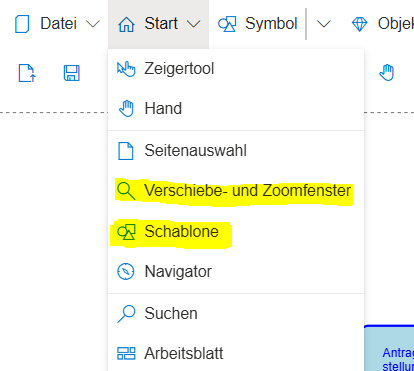

# SemTalk Online - Erste Schritte

Diese Wiki Seite gibt eine erste Übersicht über die wichtigsten Schritte zum Einrichten der SemTalk Online Umgebung für neue Benutzer.
Es wird daher empfohlen sich mit den ersten Schritten vertraut zu machen, um die eigene SemTalk Online Umgebung optimal an die eigenen Ansprüche anpassen zu können.

## Login/Registrierung

Ist ein Benutzer Account vorhanden kann direkt der Login Vorgang erfolgen. Die gewählte Rolle muss dem Benutzer zugewiesen sein. Ein Benutzer mit einfacher Modellierungsaufgabe sollte die Rolle Editor besitzen und diese für den Login auswählen.

Eine ausführlichere Erklärung zum Login-Bildschirm ist hier zu finden:
[Wiki Seite: SemTalk-Login](https://github.com/SemTalkOnline/SemTalkOnline_DE/wiki/SemTalk-Login) 

## Registrierung

Ist kein Benutzer Account vorhanden, kann eine Registrierung erfolgen, sofern dies in der Applikation freigegeben ist. In der Demo Applikation können sich Benutzer zu Testzwecken frei registrieren und bekomme die Editor Rolle zugewiesen.

Eine ausführlichere Erklärung zum Registrierungsbildschirm ist hier zu finden:
[Wiki Seite: SemTalk-Registrierung](https://github.com/SemTalkOnline/SemTalkOnline_DE/wiki/SemTalk-Registrierung) 

# Konfiguration der SemTalkOnline Oberfläche (Editor Ansicht)

## Schablone, Verschiebe- und- Zoom Fenster und Weiteres

Wichtige Werkzeuge um Prozessmodelle erfolgreich erstellen zu können, sind die Schablone mit den Modellierungselementen und das Verschiebe- und- Zoomfenster.
Je nach Grundkonfiguration der Applikation und Vorliebe des Nutzer können diese Werkzeuge jedoch angepasst werden.

Im Menüpunkt Start können die Werkzeuge ein und ausgeblendet werden (gleiches gilt für ein Seitenauswahlfenster und den Navigator). D.h. sind diese Werkzeuge nach öffnen des Editors nicht sichtbar, ist es ggf. notwendig diese einmal einzublenden.

Desweiteren kann die Positionierung der Werkzeuge bestimmt werden. Im Optionsmenü (Zahnrad oben rechts) lässt sich im Tab Allgemein einstellen ob die Werkzeuge entweder am linken oder rechten Rand des Editors verankert werden sollen. Links oder Rechts lässt sich über den Schalter "Schablone" einstellen.
Ist die Option zum Verankern nicht angehakt, wird das Werkzeug in einem verschiebbaren Fenster dargestellt, was frei verschoben und vergrößert/verkleinert werden kann.

Weitere Optionen für den Anfang:
- Brotkrumen- Navigationsleiste: Hat eine Datei mehrere untereinander verknüpfte Zeichenblätte, kann ein Brotkrumenpfad eingeblendet werden, welcher ein hilfreiches Werkzeug zur Navigation zwischen den Diagrammseiten sein kann.
- Hyperlinks durch Symbol darstellen: Werden bei der Modellierung Hyperlinks genutzt, muss diese Option aktiviert sein damit kleine Indikator-Icons an den Modellelementen mit Hyperlink angezeigt werden.
- Verfeinerungen unterstreichen: Speziell in der BPMN Notation können Verfeinerungen genutzt werden. Verfeinerte Aufgaben können entweder eine Unterstreichung des Namens als Indikator für eine vorhandene Verfeinerung haben oder, falls diese Option nicht aktiviert ist, das typische BPMN "+" Symbol.

## Menu-Struktur

Das Hauptmenü verfügt über eine Vielzahl von Funktionalitäten.
Diese werden auf anderen Wiki Seiten detailiert beschrieben. Folgen Sie den Links, um mehr Details zu erfahren:
- [Wiki Seite: Menüeintrag Datei](https://github.com/SemTalkOnline/SemTalkOnline_DE/wiki/Menüeintrag-Datei)
- [Wiki Seite: Menüeintrag Ansicht](https://github.com/SemTalkOnline/SemTalkOnline_DE/wiki/Menüeintrag-Ansicht)
- [Wiki Seite: Menüeintrag Symbol](https://github.com/SemTalkOnline/SemTalkOnline_DE/wiki/Menüeintrag-Symbol)
- [Wiki Seite: Menüeintrag Objekt](https://github.com/SemTalkOnline/SemTalkOnline_DE/wiki/Menüeintrag-Objekt)
- [Wiki Seite: Menüeintrag Prozess](https://github.com/SemTalkOnline/SemTalkOnline_DE/wiki/Menüeintrag-Prozess)
- [Wiki Seite: Menüeintrag Diagramm](https://github.com/SemTalkOnline/SemTalkOnline_DE/wiki/Menüeintrag-Diagramm)
- [Wiki Seite: Menüeintrag Explorer](https://github.com/SemTalkOnline/SemTalkOnline_DE/wiki/Menüeintrag-Explorer)
- [Wiki Seite: Menüeintrag Extras](https://github.com/SemTalkOnline/SemTalkOnline_DE/wiki/Menüeintrag-Extras)

## Anfänge in der Modellierung

SemTalk Online arbeitet modellbasiert, d.h. über Datei-->Neu werden neue Dateien erzeugt, die der entsprechend gewählten Notation angehören.
Jede Datei kann mehrere Daigrammseiten beinhalten, welche wiederum mit den eigentlich Modellen gefüllt werden.

Um ein Prozessmodell aufbauen zu können, sind folgende Vorgehensweisen grundsätzlich relevant:

- Aus der Schablone können Symbole auf das Zeichenblatt gezogen und so Modelle aufgebaut werden
- Durch Doppelklick auf ein Objekt kann ein Name schnell verändert werden, alternativ über die Objekteigenschaften
- Objekteigenschaften können über das Kontext Menü (Rechtsklick) angepasst werden. z.B. Anhänge/Hyperlinks, Kommentare, Bearbeiter und weitere Attribute.
  - Alternativ über “Objekt” im Menü-Band
- Kanten können durch gedrückte-Linke Maustaste von der Mitte des Objektes aus auf weitere Objekte gezogen werden.
- Wird der Mauszeiger auf ein vorhandenes Symbol bewegt, wird dem Benutzer die sogenannte Schnellschablone rechts neben dem Symbol angezeigt. Durch Klick auf eines der Elemente können sehr schnell weitere Symbole angelegt werden, welche auch direkt mit dem Ausgangselement verknüpft sind.
- Um einen Unterprozess zu erzeugen, werden in SemTalk Online Verfeinerungen an Aufgaben erzeugt. [Wiki Seite: Verfeinerungen](https://github.com/SemTalkOnline/SemTalkOnline_DE/wiki/Verfeinerungen)
- Das Aussehen von Symbolen, kann mit zahlreichen Formatierungsoptionen geändert werden. Mehr dazu lässt sich auf einer separaten Seite nachlesen: [Wiki Seite: Formatierung](https://github.com/SemTalkOnline/SemTalkOnline_DE/wiki/Formatierung)
- Hyperlinks können an den meisten Symbolen erzeugt werden. die verschiedenen Optionen sind auf folgender Seite beschrieben: [Wiki Seite: Hyperlinks](https://github.com/SemTalkOnline/SemTalkOnline_DE/wiki/Hyperlinks)
- Soll eine Swimlane (in der BPMN) zu einem Pool werden, welcher aus mehreren Swimlanes besteht, wird rechts auf den Kopf des Pools/der Swimlane geklickt und dort im Kontextmenü Swimlane-->Neu ausgewählt. SemTalk Online erzeugt eine neue Swimlane innerhalb des selektierten Pools/der Swimlane. 
Soll jedoch ein neuer Pool erzeugt werden, muss das Swimlane Symbol auf der Schablone auf das Zeichenblatt geschoben werden.
Für die Arbeit mit Pools und Swimlanes empfielt es sich zuerst alle Pools und Swimlanes zu erzeugen und grundlegend zu positionieren bevor weitere Inhalte darauf platziert werden, da spätere Umgestaltung oftmals schwierig ist aufgrund der Container Funktionalität der Pools/Swimlanes.

## Objekteigenschaften

- Jedes SemTalk Element hat gurndlegende Eigenschaften, die über den Eigenschaften Dialog gesteuert werden
- Zum öffnen: 
  - Rechtsklick auf ein Symbol --> Eigenschaften
  - Menüeintrag Objekt --> Eigenschaften
  - Werkzeugleiste Stift Icon
- Name, Kommentar, Hyperlinks, Attribute können hinterlegt werden 
- je nach Elementart sind Verfeinerungen, Bearbeiter oder andere notationsspezifische Einstellungen möglich

