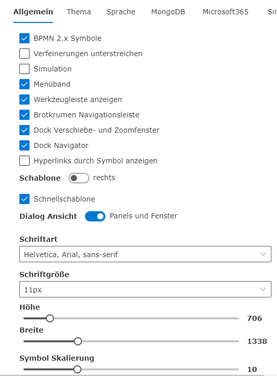

Der **SemTalk Online Optionen** Dialog enthält zahlreiche Einstellungsmöglichkeiten zum grundsätzlichen Verhalten von SemTalk Online.
Geöffnet werden die Optionen rechts oben über das Zahnrad.

**Allgemeine SemTalk Optionen**:  Die allgemeinen Optionen bieten Einstellungsmöglichkeiten zur grundlegenden Modellierung.
* BPMN 2.0 Symbole in der Schablone ein- oder ausblenden
* Verfeinerungen unterstreichen statt + Symbol
* Soll die Simulationskomponente aktiviert sein
* Hauptmenüband ein- oder ausblenden
* Werkzeugleiste ein- oder ausblenden
* Brotkrumennavigation ein- oder ausblenden
* Verschiebe- und Zoomfenster andocken
* Navigatortool andocken
* Sollen hinterlegte Hyperlinks an den Shapes symbolisiert werden
* Sollen Dialoge in Panels und Fenstern angezeigt werden
* Soll die Schnellschablone aktiv sein (vorgeschlagene Shapes direkt wenn man mit der Maus auf einem Shape ist)
* Einstellungen zur Schriftart und -größe

Im Detail sind die Einstellungsmöglichkeiten auf den Wiki-Seiten beschrieben, die sich genauer mit den Themen der jeweiligen Option befassen.

* **Thema**: Möglichkeit, die Benutzeroberfläche farblich zu verändern. Siehe [Wiki Seite: Thema](https://github.com/SemTalkOnline/SemTalkOnline_DE/wiki/Theme)

* **Sprache**: Spracheinstellung für die Oberfläche und das Modell

* **MongoDB**: Verbindungseinstellung für die Datenhaltung in einer MongoDB

* **Microsoft 365**: Integration mit Microsoft 365 Komponenten

* **Similarity Server**: Verbindungseinstellung für einen Ontology Server

