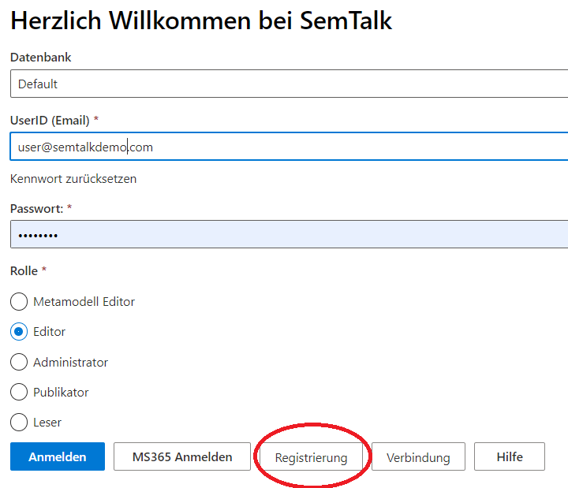

**Registrierung**: Bevor SemTalk Online genutzt werden kann, gilt es einen Account zu erstellen.

Dafür kann der Registrierungsbutton auf dem Login-Bildschirm verwendet werden.

Mit dem folgenden Dialog wird ein Account angelegt. Es wird ein Benutzername, die E-Mail Adresse und ein Passwort benötigt.
Auf der offenen SemTalk Online default-Datenbank kann sich jeder kostenlos registrieren. Der Account bekommt die Editor-Berechtigung, und es kann modelliert werden. Es ist jedoch zu beachten, dass die offene Datenbank für alle Benutzer verfügbar ist und somit die Modelle aller Benutzer sichtbar sind. Die offene Datenbank eignet sich daher nur als Testumgebung und für kleinere Projekte.
Soll eine eigene private Datenbank genutzt werden, kann über support@semtalk.com mit der Semtation GmbH in Kontakt getreten werden.

### Microsoft 365 (MS365 Anmelden)
Sowohl bei Login als auch bei Registrierung kann der Vorgang alternativ über einen Microsoft 365 Account durchgeführt werden. Wird der Button geklickt werden Sie aufgefordert sich auf Ihrem MS365 Account anzumelden und werden danach mit diesem Account auf der SemTalk Online Datenbank registriert. SemTalk Online speichert dafür Ihre E-Mail Adresse und den hinterlegten Namen. Ein extras Passwort wird nicht benötigt.
Nachdem Sie registriert sind können Sie auf der Anmeldeseite über den MS365 Button den Loginprozess durchführen. Die Authentifizierung läuft auf diese Art ausschließlich über die Authentifizierungsstellen von Microsoft 365. 

