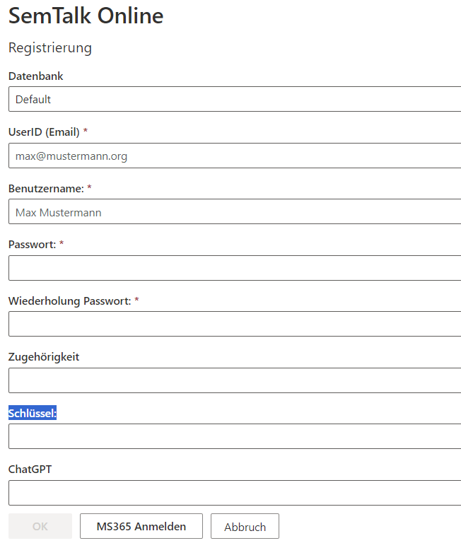

# SemTalk Online - Kurzeinführung

## Allgemeine Informationen

SemTalk Online ist die browser-basierte Variante des Modellierungswerkzeugs SemTalk. Im Gegensatz zum Visio-basierten SemTalk Editor stellen wir Ihnen hier eine Modellierungsanwendung zur Verfügung, mit der Sie auf einem modernen Technologie-Stack Ihre Geschäftsprozesse, Wissensmodelle und andere komplexe Strukturen grafisch bearbeiten und verwalten können. Modelle, die mit SemTalk Online erstellt wurden, zeichnen sich durch verschiedene Verwendungsmöglichkeiten aus: angefangen von der Präsentation in unserem SemTalk Portal über die Kompatibilität und Austauschmöglichkeit mit anderen Werkzeugen bis hin zur Integration in die Plattform Microsoft Office 365 mit ihren Komponenten Microsoft SharePoint und Microsoft Teams. Hier ergeben sich vielfältige Anwendungsmöglichkeiten im Kontext Automatisierung und Wissensmanagement. Gerne tauschen wir uns mit Ihnen zu diesen Themen aus und besprechen mögliche Einsatzszenarien im Rahmen Ihrer Digitalisierungsprojekte. Sprechen Sie uns an unter sales@semtalk.com .

## Login/Registrierung

- Die Default-Datenbank ist standardmäßig unsere Demo-Datenbank, auf der alle Inhalte für alle User sichtbar sind. Bei Bedarf kann eine kundenspezifische Datenbank individuell erstellt werden. Diese Datenbank ist zu Testzwecken und zum Kennenlernen von SemTalk Online gedacht. Es kann sich kostenlos registriert werden. Es wird jedoch davon abgeraten Produktivdaten oder sensible Informationen dort abzuspeichern.
- Rollen:
  - Leser = Read-Only Modus
  - Editor = Modellierung
  - Administrator = Modellierung und Benutzerverwaltung
  - Publikator = Veröffentlichung von Modelle im Prozessportal
  - Meta Modell Editor = Kann fortgeschrittene Anpassungen an der Modellierungsnotation vornehmen

- Die Oberfläche kann über Optionen bezüglich Sprache und Layout angepasst werden.
- Als Repository kann das SemTalk-Standard-Repository verwendet oder ein kundeneigenes erzeugt werden.

## Registrierung

- Zieldatenbank für die Registrierung
- UserID = E-Mail
- Benutzername = Anzeigename
- Passwort = Kann individuell gesetzt werden
- Schlüssel = Semtalk Online Lizenzschlüssel (kann im Demo-System leer bleiben)
- Zugehörigkeit = optionale Angabe des Unternehmens
- ChatGPT = Optionale Angabe eines Schlüssels für ChatGPT. Dieser kann für Modellierung mit der Unterstürtzung von ChatGPT genutzt werden

### Microsoft 365 (MS365 Anmelden)
- Sowohl bei Login als auch bei Registrierung kann der Vorgang alternativ über einen Microsoft 365 Account durchgeführt werden. Wird der Button geklickt werden Sie aufgefordert sich auf Ihrem MS365 Account anzumelden und werden danach mit diesem Account auf der SemTalk Online Datenbank registriert. SemTalk Online speichert dafür Ihre E-Mail Adresse und den hinterlegten Namen. Ein extras Passwort wird nicht benötigt.
Nachdem Sie registriert sind können Sie auf der Anmeldeseite über den MS365 Button den Loginprozess durchführen. Die Authentifizierung läuft auf diese Art ausschließlich über die Authentifizierungsstellen von Microsoft 365. 

# SemTalkOnline Oberfläche – Editor Ansicht

## Funktionalitäten vom Viewer sind komplett enthalten. 

- Oben am Bildschirmrand sind das Hauptmenü mit allen Funktionalitäten und die Werkzeugleiste (für schnellen Zugriff auf wichtige Funktionen) eingebunden
- Unter dem “Pan & Zoom” Fenster, Objektvorlage (Stencil/Schablone), diese können mit Hilfe von Drag & Drop aufs Zeichenblatt gezogen werden. (Rechts)
- Objektausrichtung, Layout und Modellierungsfunktionen können über das neue Menü-Band oder über die weiteren Funktionen im Menü-Band angepasst werden.

## Menu-Struktur

Das Hauptmenü verfügt über eine Vielzahl von Funktionalitäten.
Diese werden auf anderen Wiki Seiten detailiert beschrieben. Folgen Sie den Links:
- [Wiki Seite: Menüeintrag Datei](https://github.com/SemTalkOnline/SemTalkOnline_DE/wiki/Menüeintrag-Datei)
- [Wiki Seite: Menüeintrag Ansicht](https://github.com/SemTalkOnline/SemTalkOnline_DE/wiki/Menüeintrag-Ansicht)
- [Wiki Seite: Menüeintrag Symbol](https://github.com/SemTalkOnline/SemTalkOnline_DE/wiki/Menüeintrag-Symbol)
- [Wiki Seite: Menüeintrag Objekt](https://github.com/SemTalkOnline/SemTalkOnline_DE/wiki/Menüeintrag-Objekt)
- [Wiki Seite: Menüeintrag Prozess](https://github.com/SemTalkOnline/SemTalkOnline_DE/wiki/Menüeintrag-Prozess)
- [Wiki Seite: Menüeintrag Diagramm](https://github.com/SemTalkOnline/SemTalkOnline_DE/wiki/Menüeintrag-Diagramm)
- [Wiki Seite: Menüeintrag Explorer](https://github.com/SemTalkOnline/SemTalkOnline_DE/wiki/Menüeintrag-Explorer)
- [Wiki Seite: Menüeintrag Extras](https://github.com/SemTalkOnline/SemTalkOnline_DE/wiki/Menüeintrag-Extras)

## Modellierung

- Aus der Schablone können Symbole auf das Zeichenblatt gezogen und so Modelle aufgebaut werden
- Durch Doppelklick auf ein Objekt kann ein Name schnell verändert werden, alternativ über die Objekteigenschaften
- Objekteigenschaften können über das Kontext Menü (Rechtsklick) angepasst werden. z.B. Anhänge/Hyperlinks, Kommentare, Bearbeiter und weitere Attribute.
  - Alternativ über “Objekt” im Menü-Band
- Kanten können durch gedrückte-Linke Maustaste von der Mitte des Objektes aus auf weitere Objekte gezogen werden.

## Objekteigenschaften

- Jedes SemTalk Element hat gurndlegende Eigenschaften, die über den Eigenschaften Dialog gesteuert werden
- Zum öffnen: 
  - Rechtsklick auf ein Symbol --> Eigenschaften
  - Menüeintrag Objekt --> Eigenschaften
  - Werkzeugleiste Stift Icon
- Name, Kommentar, Hyperlinks, Attribute können hinterlegt werden 
- je nach Elementart sind Verfeinerungen, Bearbeiter oder andere notationsspezifische Einstellungen möglich

Weitere Funktionen können Sie über das Menü-Band entsprechend aufrufen und somit Objekte angepassen. 
Hierzu empfehlen wir Ihnen eine Schulung oder Einführungsveranstaltung.

# SemTalkOnline Oberfläche – Leser Ansicht

**Funktionalitäten sind eingeschränkt**

- Mit dem Login in der Rolle "Leser" können Modelle für Anwender im "Nur-Lese-Modus" zur Verfügung gestellt werden.
- Ansicht von Modellen und Eigenschaften von Objekten
- Export als Word, Druckversion, PNG oder JPG Datei
- Für mehr Funktionalitäten im Rahmen der Präsentation von Modellen bieten wir zusätzlich die SemTalk Services als Portal-Oberfläche an. Gerne diskutieren wir Ihre möglichen Einsatzszenarien. Kontaktieren Sie uns unter sales@semtalk.com

##  Menü-Struktur

Im Leser Modus bietet das Menü nur Optionen zum konsumieren von Modelldateien. Das Verändern einer Datei ist nicht möglich. 
Daher ist das Menü wesentlich weniger umfangreich als im Editor oder Administrator Modus.

Der Lesermodus eignet sich hervorragend um Modelle zu teilen und auch Nicht-Modellierern einen Blick auf Modelldateien ermöglichen zu können.

## Oberfläche 

- Wenn mehrere Diagramme im Modell enthalten sind, wird über dem “Pan & Zoom” Fenster ein Auswahlfeld angezeigt. (Rechts)

- Kontext-Menü an den Objekten
  - Properties = Objekteigenschaften anzeigen
  - Refine = Wenn ein Objekt eine Ausprägung hat kann entsprechend in diese gesprungen werden. 

