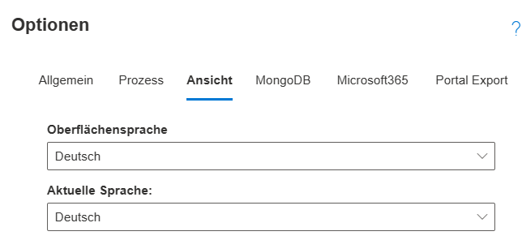
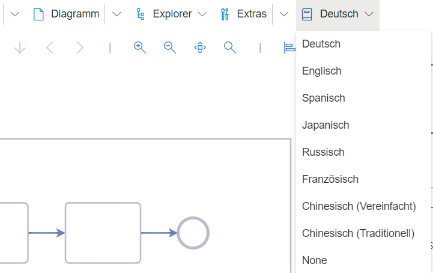

# Sprachoptionen

SemTalkOnline unterstützt zwei Arten der Spracheinstellungen.
* **Oberflächensprache:** Die Sprache der Benutzeroberfläche

Diese steht momentan auf Deutsch, Englisch, Französisch, Spanisch, Russisch, Japanisch und Chinesisch (sowohl vereinfacht als auch traditionell) zur Verfügung. Wird diese Einstellung umgestellt, wechseln alle Oberflächenelemente in die gewählte Sprache.
Um die Oberflächensprache zu wechseln, geht man zu Einstellungen (Zahnrad rechts oben) --> Ansicht --> Oberflächensprache-Auswahlbox

_Wichtig: Vor Änderungen im Einstellungsmenü ist es wichtig, das geöffnete Modell zu speichern, um Datenverlust zu vermeiden._   
Ferner gilt es zu beachten, daß nach einer Umstellung der Oberflächensprache u.U. die "Bubble-Help" der Werkzeugleiste nicht sofort umgestellt ist
(im Gegensatz zum Hauptmenü). Sollte das der Fall sein, muß die Webseite im Browser neu geladen werden. Danach ist dann auch die "Bubble-help" auf die
richtige Sprache umgestellt.

* **Aktuelle Modellsprache:** 

SemTalk Online-Modelle unterstützen Mehrsprachigkeit bei der Modellierung. Die Sprache, welche im linksbündigen Hauptmenü ganz rechts sichtbar ist, ist die Sprache, in der momentan modelliert wird, d.h. SemTalk Online weist alle eingegebenen Benennungen der Modellelemente automatisch der eingestellten Sprache zu. Es ist daher empfehlenswert, ein Auge darauf zu haben, wie die Modellsprache gesetzt ist, damit passend zur Spracheinstellung modelliert wird. 

Wird die aktuelle Modellsprache geändert, stellt SemTalk Online automatisch alle modellierten Elemente auf die neue Sprache um, sofern für diese Sprache Übersetzungen existieren. SemTalk Online beachtet dabei sogar die korrekte Wortstellung im Vokabular bzgl. der jeweiligen Sprache (z.B. Substantiv+Verb im Deutschen; Verb+Noun im Englischen)

# Mehrsprachig modellieren

**Der erste und, für einfachste Modelle, schnellste Weg**, um mehrsprachige Modelle zu entwickeln, ist, das Modell zuerst in einer Sprache zu entwickeln und dann in eine andere Sprache zu übersetzen. 
Kleines Beispiel: Ein BPMN-Modell wird in Deutsch erstellt

Anschließend wird die Modellsprache auf Englisch umgestellt. Die BPMN-Aufgaben können danach so benannt werden, wie sie auf Englisch heißen sollen.

SemTalkOnline hat nun für die Modellierungsobjekte beide Übersetzungen angelegt und kann je nach ausgewählter Sprache immer automatisch die passende Übersetzung anzeigen.

Die **zweite Möglichkeit**, Mehrsprachigkeit zu verwalten, ist das Übersetzen-Tool. Es ermöglicht alle angelegten Übersetzungen für jedes Modellelement einzusehen, neue Übersetzungen anzulegen und auch Vokabular-basiert zu übersetzen. Eine detaillierte Beschreibung des Tools ist auf der entsprechenden [Wiki Seite: Übersetzen](https://github.com/SemTalkOnline/SemTalkOnline_DE/wiki/Übersetzen) zu finden.

# Objektbasiert mehrsprachig modellieren

Sollen große Modelle oder auch mehrere Modelle mehrsprachig angelegt werden, bietet es sich an, die Vokabular- und Repository-Funktionalitäten zu nutzen. Schauen Sie dazu in die entsprechenden Seiten dieses Tutorial-Wikis.
