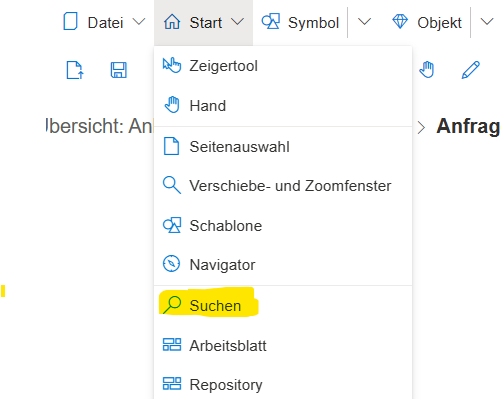
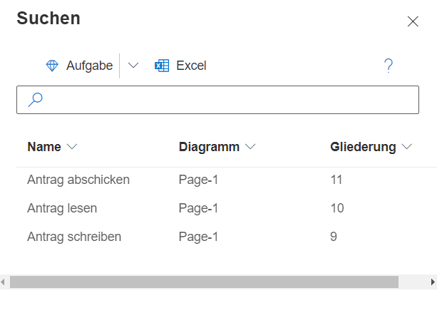

Mit der Suchfunktion lassen sich Modellelemente einfach finden und filtern.

Dazu kann über den Menüpunkt "Start" --> "Suchen" ein Dialog geöffnet werden.

Der Suchdialog kann über eine gewählte Metamodellklasse alle Modellobjekte vorfiltern (im Screenshot nach der BPMN-Klasse Aufgabe) und zeigt dann alle Elemente dieser Klasse an. Mittels des Eingabefeldes kann das Suchergebnis auf Begriffe, die spezielle Zeichenfolgen enthalten, weiter eingeschränkt werden.

Per Doppelklick auf ein Suchergebnis kann direkt in den Eigenschaften-Dialog des Eintrags gesprungen werden.

Suchergebnisse können mittels des Excel-Buttons exportiert und lokal gespeichert werden.
