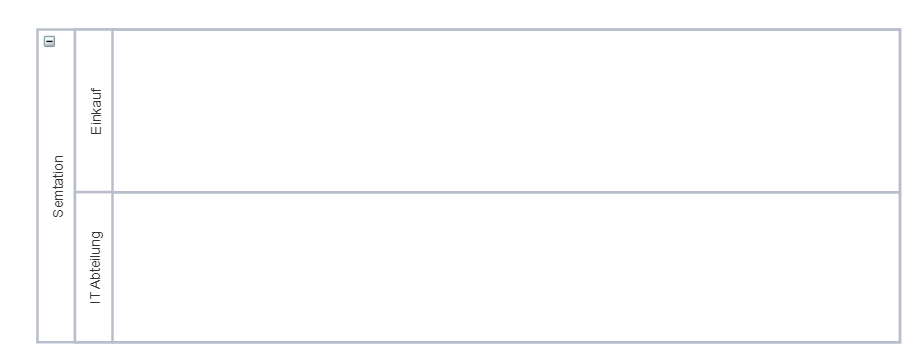
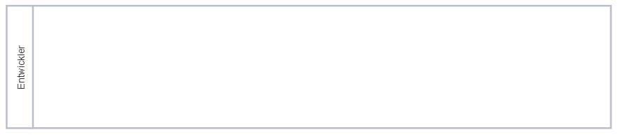
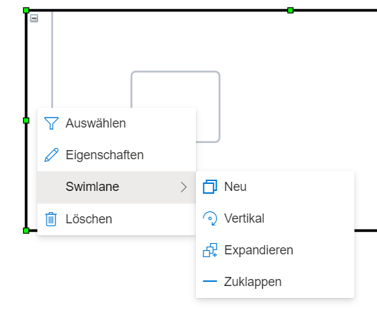
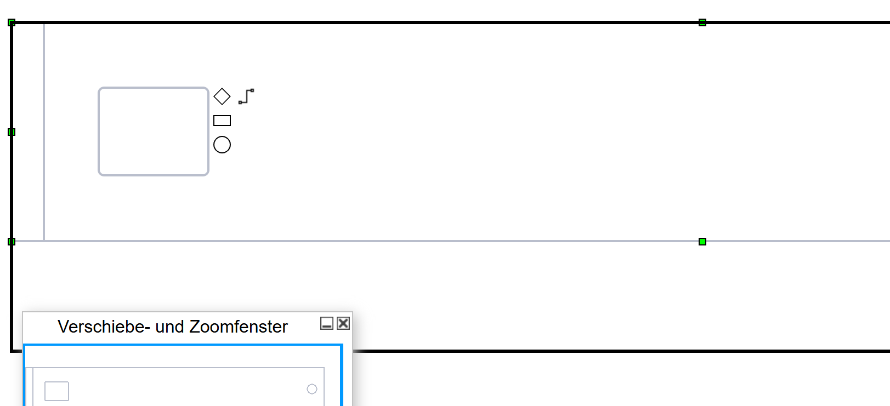

**Swimlanes und Pools** werden verwendet, um Prozesse strukturiert nach Bearbeitereinheiten darzustellen. Dies kommt ursprünglich aus der BPMN-Notation und findet dort in der Regel auch meist Anwendung.
In SemTalk Online sind Swimlanes jedoch auch für andere Notationen verfügbar, z.B. EPK.

Unterschieden wird weiterhin in: 
**Pool**: repräsentieren größere Organisationen, z.B. Unternehmen oder eine ganze Abteilung. Ein Pool umfasst mehrere Swimlanes. 
**Swimlanes**: repräsentieren Bearbeiter. Das können, je nach Detaillierungsgrad Personen, Rollen oder auch kleinere Organisationseinheiten sein.

Ein Pool mit der Organisation "Semtation" umfasst im Beispiel zwei Swimlanes ("IT-Abteilung" und "Einkauf").

Eine alleinstehende Swimlane.

**Swimlanes und Pools** können angelegt werden durch:

* Ziehen des Swimlane-Icons aus der Schablone auf das Zeichenblatt 
* Rechtsklick auf eine bestehende Swimlane. Im Kontextmenü Swimlane --> Neu
* Im Hauptmenüeintrag "Prozess" --> Swimlane --> Neu

Swimlanes können **vertikal oder horizontal** angezeigt werden. "Horizontal" ist hierbei die Grundeinstellung. Um auf "vertikal" umzustellen, gibt es folgende Möglichkeiten:
* Rechtsklick auf eine bestehende Swimlane. Im Kontextmenü Swimlane --> Vertikal
* Im Hauptmenüeintrag "Prozess" --> Swimlane --> Vertikal

Swimlanes lassen sich zu- und aufklappen:
* Rechtsklick auf eine bestehende Swimlane. Im Kontextmenü Swimlane --> Expandieren oder Zuklappen
* Im Hauptmenüeintrag "Prozess" --> Swimlane --> Expandieren oder Zuklappen

_**Achtung:**_ Wenn eine Swimlane gelöscht wird, werden automatisch alle Shapes mit entfernt, die sich in der Swimlane befunden haben. 

Die Größe von Swimlanes und Pools kann individuell angepasst werden. Dazu muss die Swimlane die sie anpassen möchten, mit Linksklick ausgewählt werden. Die Größe lässt sich dann an den jeweiligen grünen Verschiebepunkten in die gewünschte Richtung anpassen. 
* Bewegen des Mauszeigers auf Verschiebepunkt
* Der Mauszeiger wird zu einem Doppelpfeil der vorgibt in welche Richtung sie die Swimlane verschieben können

Swimlanes können nach Bedarf verschoben, miteinander verbunden und Pools hinzugefügt werden.
*  Linksklick und halten auf den Rand oder den Kopf der Swimlane um sie zu verschieben
*  Rand einer Swimlane an Rand anderer Swimlane anfügen bis eine gestrichelte rote Linie erscheint und loslassen um Swimlanes miteinander zu verbinden
*  Swimlane in Kopfzeile eines Pools verschieben um sie dem Pool hinzuzufügen 

