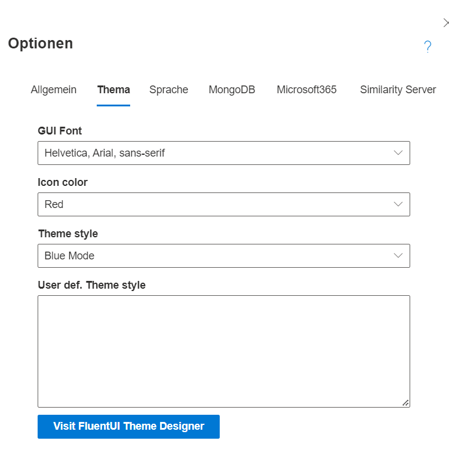

Themes werden benutzt, um das farbliche Aussehen der Benutzeroberfläche anzupassen. Einstellbar ist das Theme in den SemTalk Optionen (Zahnrad rechts oben) im Tab "Ansicht". 
Dort kann die Schriftart der Oberfläche, die Farbe der Menü Icons und der allgemeine Farbstil gesetzt werden.

Das Farbschema basiert auf dem Fluent UI Theme Designer. SemTalk Online liefert bereits Auswahlmöglichkeiten mit. Falls diese aber nicht ausreichen, können auch eigene Farbschemen integriert werden. Dafür ist es notwendig, mit dem Designer ein neues Schema zu erstellen und dies dann nach SemTalk Online als JSON-Format in das Eingabefeld zu kopieren. [Fluent UI Theme Designer](https://fluentuipr.z22.web.core.windows.net/heads/master/theming-designer/index.html)

