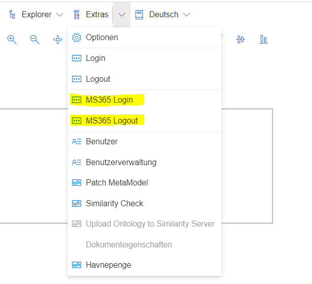

Für bestimmte Features kann SemTalk Online mit der Microsoft 365 Umgebung interagieren, z.B. mit dem Planner, dem Terminology-Speicher oder SharePoint Bibliotheken.

Dafür gibt es im Menüpunkt "Extras" die Möglichkeit, sich mit einem Microsoft 365 (MS365) Account anzumelden. SemTalk Online kann dadurch eine Session zur Microsoft 365 Umgebung öffnen, und der Benutzer kann die Modellinformationen dann auf verschiedenste Weisen in Microsoft-Applikationen einbringen (natürlich gilt das nur, wenn diese Applikationen für den Benutzeraccount abonniert sind). 

Nach dem Klicken des MS365 Login Eintrages, wird der Benutzer aufgefordert, seinen Nutzernamen und das Passwort einzugeben. SemTalk Online speichert weder Benutzername noch Passwort. Der Login erfolgt ausschließlich über die von Microsoft angebotene Login-Schnittstelle.

Mit dem MS365 Logout Eintrag wird sich von Microsoft 365 wieder abgemeldet.

