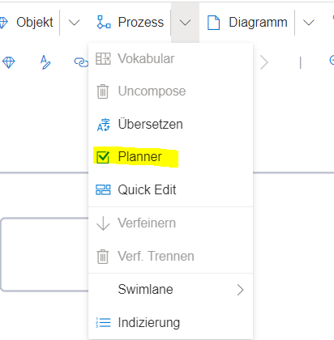
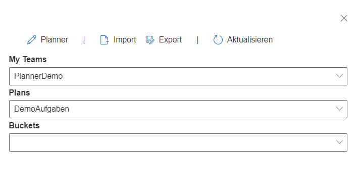
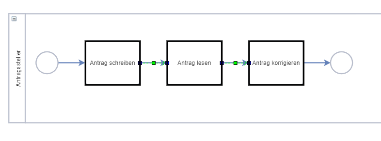
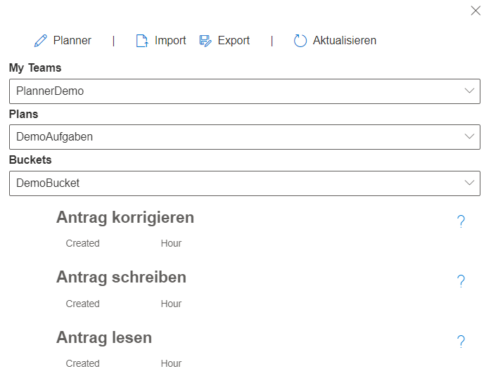
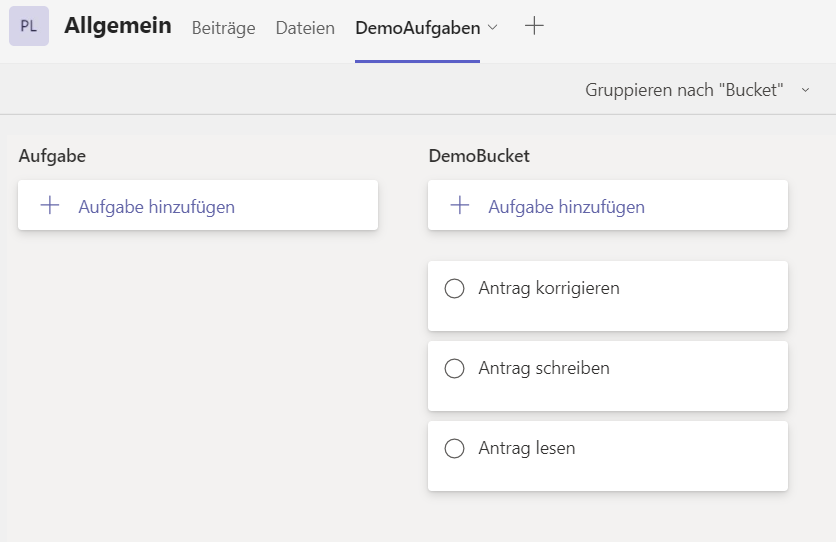
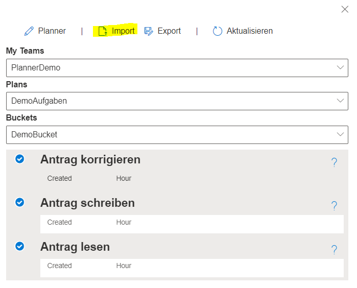
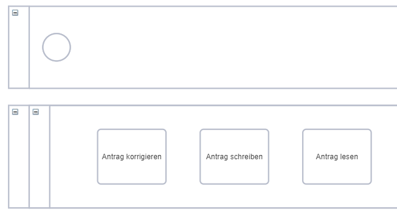
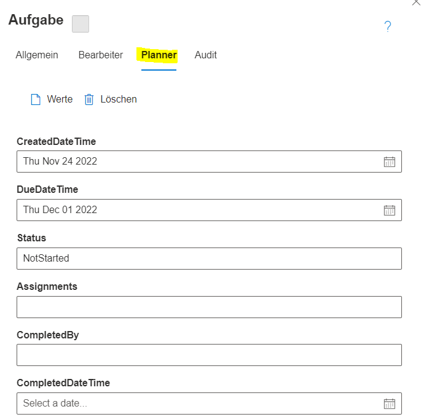
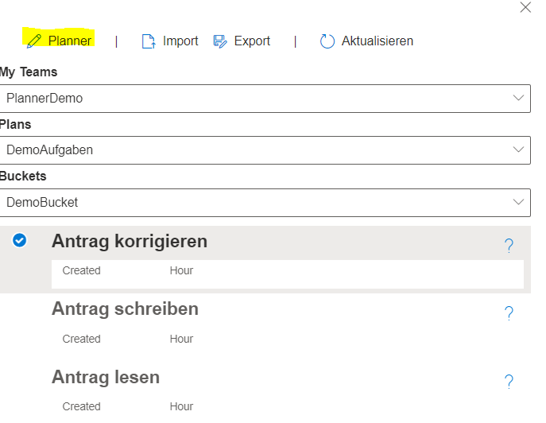
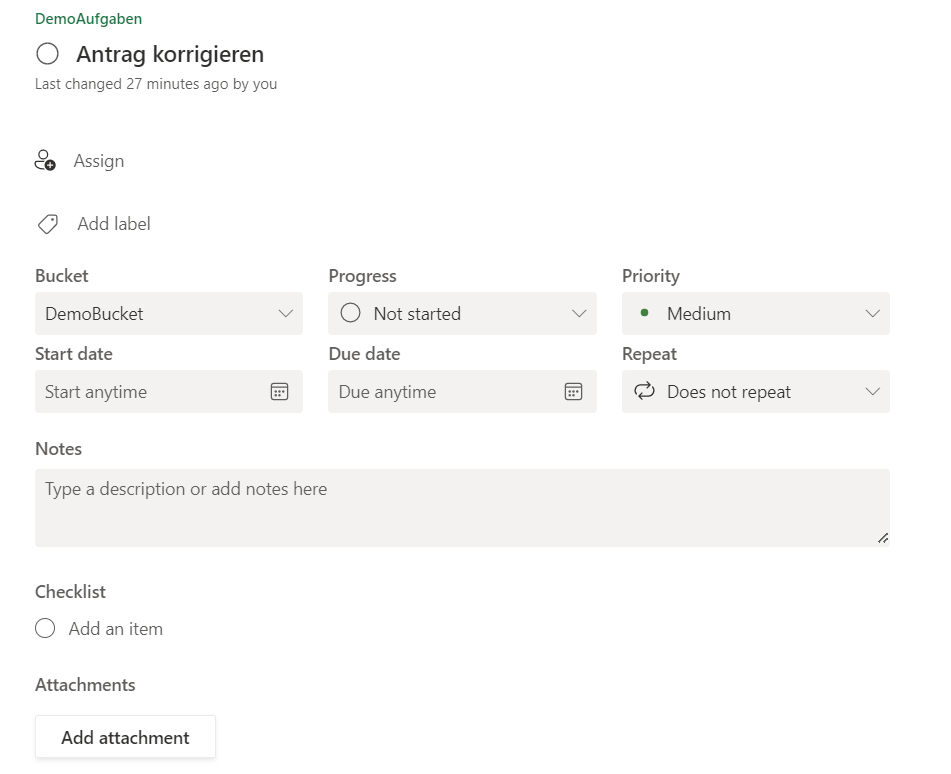

SemTalk Online enthält eine Exportfunktionalität, mit welcher Prozessaufgaben nach Microsoft Planner exportiert werden können.
Im Menüeintrag "Prozess" ist der Planner Dialog zu finden. Falls noch keine Verbindung zu Microsoft 365 besteht, wird der Benutzer als erstes aufgefordert eine Anmeldung mit seinem Microsoft 365 Account durchzuführen.

Nach erfolgreicher Anmeldung öffnet sich der Planner Dialog. Dort muss als erstes ein Microsoft Team ausgewählt werden. SemTalk Online stellt alle Teams zur Auswahl in denen sich der angemeldete Microsoft 365 Account befindet. Anschließend kann aus dem Team ein vorhandenes Planner Board gewählt werden. Hat dieser Plan bereit Inhalt werden die vorhandenen Aufgaben im Dialog angezeigt. Der Benutzer hat weiterhin die Möglichkeit nach Bucket zu filtern. Über den Import Button können selektierte Aufgaben in das geöffnete SemTalk Online Prozessmodell importiert werden.

Leeres Planner Board:

# Export von Aufgaben

Als Beispiel dient ein kleiner BPMN Prozess, dessen Aufgaben in ein Planner Board transferiert werden sollen.

Dazu werden erst alle Aufgaben selektiert und dann der Planner Dialog geöffnet. Dort muss nun der Export Button betätigt werden und SemTalk Online exportiert die Aufgaben in das gewählte Board (und den gewählten Bucket).

Im Planner Board in Team sieht das wie folgt aus:

Auf diese Art und Weise können Planner Boards sehr schnell grundlegend befüllt werden. Detaillierte Konfigurationen wie Zuweisung von Bearbeitern, Bezeichnungen, Kommentaren oder Datumsangaben müssen dann in Planner direkt gemacht werden. Angedachter Anwendungsfall ist hier z.B. ein Szenario wo Projektteams zu ähnlichen oder gleichen Themen regelmäßig angelegt werden müssen, welche unter anderem Planner Boards beinhalten sollen. Mit SemTalk Online können alle Aufgaben als Projektprozess einmalig modelliert und dann immer wieder exportiert werden. Grundlegende Anpassungen lassen sich ebenfalls an zentraler Stelle in SemTalk Online machen.

# Import von Aufgaben

Gefüllte Planner Boards können nach SemTalk Online importiert werden.
zur Demonstration wird eine leere BPMN Datei geöffnet. Die Aufgaben, die im Export Abschnitt nach Team geschrieben worden, sollen nun wieder in das neue Modell importiert werden. Dafür wird der Planner Dialog geöffnet, das Team mit Planner Board und der entsprechende Bucket ausgewählt. SemTalk Online zeigt wieder die vorhandenen Aufgaben an. Werden diese selektiert und dann der Import Button betätigt, erstellt SemTalk Online einen neuen Pool mit Swimlane auf der Zeichenfläche und positioniert die Aufgaben darin.

Es gilt zu beachten dass SemTalk Online keinen Abgleich mit den Aufgaben vornimmt, die evtl. bereits auf dem Zeichenblatt vorhanden sind. Auch werden keine vorhanden Swimlanes genutzt. Der vorhandene Prozess wird daher nicht verändert, sondern nur um einen weiteren Pool mitsamt den Aufgaben ergänzt.

Sind bei einer Planner Aufgabe bereits Attribute wie Fälligkeitsdatum, Startdatum, Status etc. gesetzt werden diese von SemTalk automatisch mit importiert. Sobald ein Import durchgeführt wurde, wird im Eigenschaften Dialog der Aufgaben ein "Planner" Tab sichtbar, in welchem die Attribute eingesehen werden können. Durch den Aktualisieren Button im Planner Dialog können die Attributewerte auch nach Import weiter aktualisiert werden, wenn sich im Planner Board die Werte geändert haben. So kann der Prozess zum Planner Board auch immer die aktuellen Werte widerspiegeln und anzeigen.

Ein User Case für den Import könnte der Fall sein dass aus Planner Boards strukturierte und übersichtliche BPMN Prozesse abgeleitet werden sollen, um beispielsweise nach Projektabschluss den Ablauf der Aufgaben zu formalisieren.

# Verlinkung nach Planner

Wenn Aufgaben in einem Planner Board vorhanden sind, kann Semtalk Online einen direkten Link dorthin in einem neuen Tab öffnen. Dafür muss eine Aufgabe selektiert sein und und der Planner Button betätigt werden.

SemTalk Online öffnet daraufhin die gewählte Aufgabe in der Planner Applikation wo der Benutzer schnell detailliertere Konfiguration vornehmen kann.

