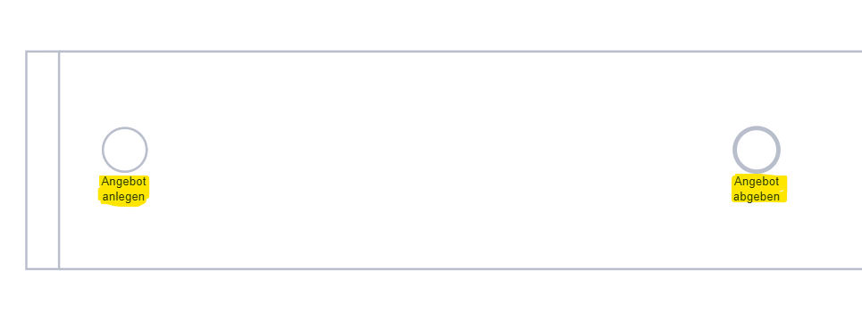

**Verfeinerungen** werden genutzt, um Prozessaufgaben in detailiertere Teilaufgaben herunterzubrechen (vor allem in der BPMN-Notation aber auch EPK). Die Teilaufgaben werden dafür auf einem neuen Zeichenblatt dargestellt und sind somit Teil eines untergeordneten Prozessdiagramms. 
Dies verbessert die Lesbarkeit von umfangreichen Prozessmodellen und hilft gleichzeitig, die Prozessmodelle zu strukturieren.

# Interne Verfeinerungen anlegen

Interne Verfeinerungen sind Verfeinerungen auf einem Zeichenblatt, welches sich in derselben Modelldatei befindet oder dort neu hinzugefügt werden soll.
Diese werden angelegt, indem auf eine Prozessaufgabe (welche vorher einen sprechenden Namen erhalten sollte) **rechts geklickt** wird und aus dem Kontextmenü "Verfeinern" ausgewählt wird. 

Alternativ kann das Aufgabenshape auch selektiert und **über den Menüeintrag** "Prozess" --> "Verfeinern" ausgewählt werden.

Daraufhin erzeugt SemTalk Online ein neues Zeichenblatt mit dem Namen der verfeinerten Aufgabe. Auf diesem Unterprozessdiagramm kann nun weiter modelliert werden.

**Eine weitere Möglichkeit, Verfeinerungen hinzuzufügen** ist im Eigenschaften-Dialog der Aufgaben zu finden. Mittels des "Neu"-Buttons kann eine interne Verfeinerung angelegt werden. An dieser Stelle ist es möglich, anders als bei den beiden erst genannten Wegen, den Diagrammnamen und die Diagrammart der neuen Diagrammseite zu wählen, zu welcher die Verfeinerung führen soll. Das Diagramm wird dann entsprechend von SemTalk Online neu angelegt.

Verfeinerte Aufgaben werden mit einem + Zeichen im Aufgabenshape symbolisiert. 

In den SemTalk Online-Optionen (Zahnrad rechts oben) kann dies auf Unterstreichung des Aufgabennamens umgestellt werden.

# Interne Verfeinerungen und Schnittstellen

Sobald in einem bestehenden Geschäftsprozess eine Aufgabe verfeinert wird, in folgendem Beispiel etwa die Aufgabe "Angebot abstimmen",

übernimmt SemTalkOnline automatisch den vorherigen Schritt als Startpunkt bzw. den nachfolgenden Schritt als Endpunkt in der Verfeinerung, sofern diese existieren (vgl. das folgende Bild)

Danach kann der Benutzer wie gewohnt modellieren, um die Verfeinerung zu beschreiben. 
Die von SemTalkOnline automatisch erzeugten Ereignisse stellen nun logisch die Schnittstellen der Verfeinerung zum übergeordneten Geschäftsprozess dar.
Die Schnittstellen können über den Eigenschaften-Dialog eines Ereignis (Ereignis -> Schnittstelle) abgefragt werden

Im Falle des Startereignis einer Verfeinerung beschreibt die Schnittstelle, von welcher Aufgabe des übergeordneten Geschäftsprozesses die Verfeinerung ausgelöst wird. Handelt es sich um das Endereignis einer Verfeinerung, so gibt die Schnittstelle an, welche Aufgabe im übergeordneten Geschäftsprozess folgt.

**Wichtiger Hinweis:** Die Ereignisse sind nun durch die Schnittstellen bezeichnet. Will man den Ereignissen (z.B. durch die Vokabular-Funktion) anders benennen, so werden die Schnittstellen nicht überschrieben. Sollen die Ereignisse nur durch die andere Benennung beschrieben werden, müssen die bestehenden Schnittstellen gelöscht werden.
# Externe Verfeinerungen anlegen

Eine externe Verfeinerung verlinkt eine andere Modelldatei; d.h. wenn es bereits andere Modelle in der SemTalk Online Datenbank gibt, können diese als externe Verfeinerungen in das aktuell geöffnete Modell eingebunden werden.

Externe Verfeinerungen können ausschließlich über den Eigenschaften Dialog des zu verfeinernden Shapes angelegt werden. Dafür wird der "Extern" Button genutzt. SemTalk Online öffnet dafür einen Dialog, welcher alle existierenden Modelldateien zeigt. Die dort gewählte Datei wird dann als externe Verfeinerung verlinkt.

Das Öffnen einer externen Verfeinerung muss mit Vorsicht vorgenommen werden, da SemTalk Online dafür das geöffnete Modell schließt und danach die Verfeinerung öffnet. Es sollte daher vorher gespeichert werden.

# Verfeinerungen entfernen

Verfeinerungen können wieder entfernt werden, indem das verfeinerte Shape selektiert und dann im Menüpunkt "Prozess" --> "Verf. Trennen" ausgewählt wird.

Alternativ lassen sich Verfeinerungen (intern sowie extern) im Eigenschaften Dialog des verfeinerten Shapes entfernen. Dort muss die Verfeinerung selektiert und der "Löschen"-Button genutzt werden.

Das Shape wird nun wieder ohne Verfeinerungssymbol dargestellt. Die Verlinkung zum ehemaligen Unterprozess wurde entfernt. Der Unterprozess existiert jedoch weiterhin. Soll dieser ebenfalls gelöscht werden, muss der Unterprozess geöffnet werden und kann dann über den Menüeintrag "Diagramm" --> "Löschen" entfernt werden.

# Durch Verfeinerungsebenen navigieren

Um in Unterprozesse zu springen, kann der "Verfeinern"-Eintrag im Kontextmenü sowie über den Menüeintrag "Prozess" verwendet werden, analog dazu, wie es im Abschnitt "Verfeinerung anlegen" beschrieben ist. 
Um eine Prozessebene nach oben zu gehen, wenn sich der Benutzer in einem verfeinerten Prozessdiagramm befindet, kann der Menüeintrag "Diagramm" --> "Aufwärts" genutzt werden. SemTalk Online springt dann auf die Prozessebene, auf der sich die verfeinerte Aufgabe zum Diagramm befindet.

Alternativ kann auch das Navigator-Tool benutzt werden, welches auf einer separaten Seite in diesem Wiki-Tutorial beschrieben ist.

