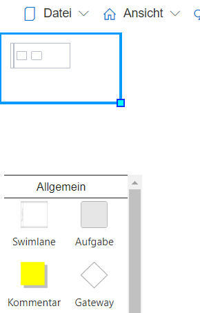
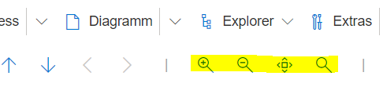
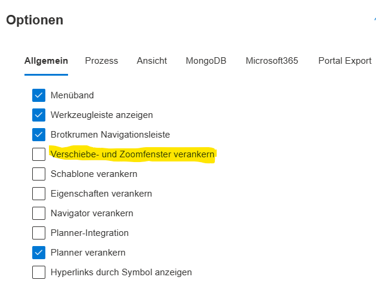

Das Verschiebe- und Zoomfenster kann benutzt werden, um im Prozessdiagramm effektiv zu navigieren.
Mit der Maus kann der Diagrammausschnitt verschoben, sowie vergrößert und verkleinert werden.

Über die Icons in der Werkzeugleiste kann der Zoomfaktor ebenfalls angepasst werden.

Im Optionsmenü (Zahnrad oben rechts) lässt sich das Verschiebe- und Zoomfenster vom Rand lösen und kann danach frei bewegt werden. Dafür muss die Einstellung "Verschiebe- und Zoomfenster verankern" deaktiviert werden (Optionen -> Allgemein). 
**Bitte beachten:** Bevor Änderungen im Optionsmenü vorgenommen werden, sollte die Modelldatei gespeichert werden.

