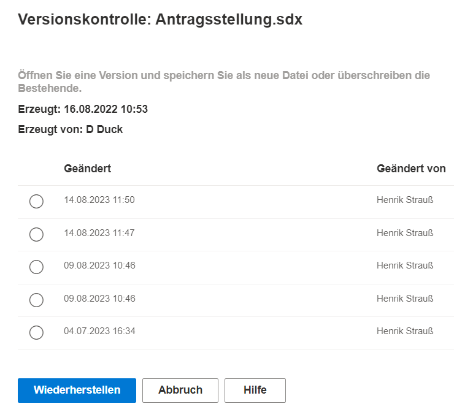

**Versionskontrolle:**

Soll eine alte Version der Modelldatei wiederhergestellt werden, kann die Versionskontrolle genutzt werden. Hier sind mindestens 5 alte Versionen der Datei hinterlegt, sofern bereits so oft gespeichert wurde. (in den Settings kann auch eine größere Anzahl von Versionen eingestellt werden)
Eine der Versionen kann selektiert werden und dann über den Wiederherstellen-Button geöffnet werden. Soll die alte Datei wieder zur aktuellen gemacht werden, kann die neuere Version einfach überschrieben oder als neue Datei gespeichert werden.

