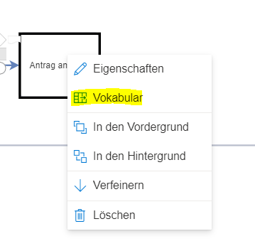
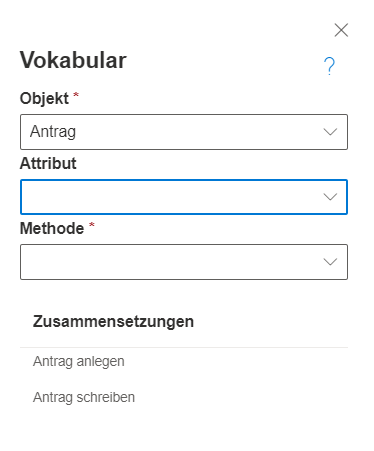
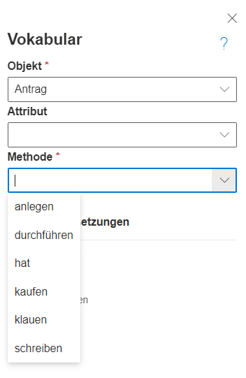

Die Vokabularfunktionalität erlaubt es, Prozessaufgaben konsistent und objektbasiert zu benennen indem das Vokabular, welches für Aufgaben, Ereignisse oder Entscheidungen (Gateway) genutzt werden soll, bewusst zentral über einen kontrollierten Dialog angelegt wird. 
Das erlaubt Mehrfachverwendung dieser Begriffe, fördert die Konsistenz der in der Modellsprache und erleichtert den Umgang mit dem Thema Mehrsprachigkeit.

Per Rechtsklick auf eine Aufgabe, Ereignis oder Entscheidung kann der Vokabular Dialog aus dem Kontextmenü geöffnet werden.

Wird mit Vokabular gearbeitet, schreibt der Modellierer nicht den Titel einer Aufgabe, eines Ereignisses oder eines Gateways direkt in das entsprechende Shape, sondern geht strukturierter vor, indem Geschäftsobjekte, Methoden und Zustände genutzt werden, um den Titel aus mehreren Begriffen zusammenzusetzen.
Diese einzelnen Begriffe können mehrfach verwendet werden (über das [Repository](https://github.com/SemTalkOnline/SemTalkOnline_DE/wiki/Repository) auch dateiübergreifend), damit alle Prozessmodelle auf dieselbe Begriffswelt zurückgreifen können. So kann vermieden werden, dass unterschiedliche Modellierer unterschiedliche Begriffe für dasselbe Objekt verwenden. Ebenso können Objekte auch zentral übersetzt werden und somit auch Mehrsprachigkeit leichter und schneller in mehrere Dateien gebracht werden (siehe [Sprache in SemTalk](https://github.com/SemTalkOnline/SemTalkOnline_DE/wiki/Sprache-in-SemTalk)). 

Der Vokabular Dialog enthält 3 Felder:
* Objekt: Hier wird das Geschäftsobjekt angegeben, auf dem die Aufgabe durchgeführt wird, z.B. ein Antrag.
* Methode/Zustand: Je nach Prozesselement kann eine Methode (bei einer Aufgabe) oder ein Zustand (bei Ereignissen und Gateways) angegeben werden. Dies beschreibt dann entweder, was mit dem Geschäftsobjekt gemacht wird, oder in welchem Zustand es sich befindet.
* Attribut: Attribute können in die Objekt Methode/Zustand Beschreibung integriert werden. Beispielsweise kann ein Antrag das Attribut Sprache haben. Zusammen mit der Methode "festlegen" könnte das "Antrag Sprache festlegen" ergeben.

Unter den 3 Eingabefelder werden bereits verwendete Zusammensetzungen des ausgewählten Objekts angezeigt.

Die 3 Eingabefelder sind Auswahlfelder, d.h. es ist möglich, neue Begriffe einzugeben, aber es werden auch alle vorhandenen Begriffe in diesen Feldern angezeigt, welche zur erneuten Nutzung gewählt werden können. Wird ein vorhandenes Objekt gewählt, wird die Auswahl in den Methoden/Zustands- oder Attributsfeldern bereits so gefiltert, dass nur die Begriffe angezeigt werden, die bereits an anderer Stelle mit dem Objekt verknüpft sind, oder wo eine Verknüpfung im Repository vorkonfiguriert ist. So wird im Screenshot für den Antrag nur noch eine Unterauswahl aller Methoden angezeigt. Es können jedoch trotzdem auch neue Methoden eingegeben werden, welche wiederum dem gewähten Objekt hinzugefügt werden.

Unter den Auswahlfeldern wird zusätzlich eine Liste an existierenden Zusammensetzungen in der Datei angezeigt. Davon kann über Doppelklick eine ausgewählt werden, wenn diese wiederverwendet werden soll. Die Auswahlfelder werden dann automatisch entsprechend gefüllt.

