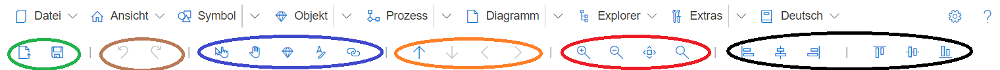
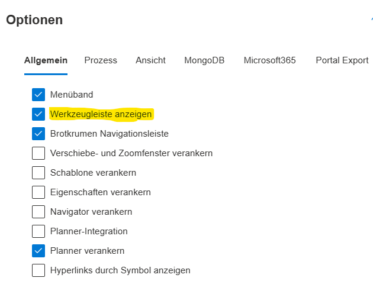

Die SemTalk-Werkzeugleiste enthält eine Vielzahl von Funktionalitäten (aufgeteilt in Gruppen), die während der Modellierung benötigt werden.

##  Inhalt der Werkzeugleiste

Folgende Funktionalitäten sind zu finden:
* Grün: Datei öffnen und speichern
* Braun: Modellierungsaktionen rückgängig machen und Wiederholen von rückgängig gemachten Aktionen
* Blau: Grundlegende Funktionalitäten zum Arbeiten mit einem Shape:
  * Zeigertool: Ist der normale Modus, der das Arbeiten mit den Modellelementen erlaubt.
  * Hand: Ändert den Modus in einen Verschiebe-Modus, mit dem sich ausschließlich Modellelemente verschieben lassen.
  * Eigenschaften: Öffnet den Eigenschaften-Dialog eines selektierten Elements
  * Formatierung: Öffnet den Formatierungsdialog eines selektierten Elements
  * Hyperlinks: Öffnet den Dialog zum Hinzufügen von Hyperlinks zu einem selektierten Element
* Orange: Navigationsunterstützung (in Verfeinerung springen, Aufwärts aus der Verfeinerung, Vor/Zurück)
* Rot: Zoomeinstellungen (Größer, Kleiner, Anpassen auf maximale Größe, Originalgröße)
* Schwarz: Unterstützung beim Ausrichten mehrerer selektierter Modellelemente. 

## Werkzeugleiste aktivieren

Ist die Werkzeugleiste nicht eingeblendet, muss sie in den SemTalk-Optionen aktiviert werden. Die Optionen werden über das Zahnrad rechts oben geöffnet. Dort muss die Checkbox für "Werkzeugleiste anzeigen" unter "Optionen-> Allgemein" aktiviert werden.

  