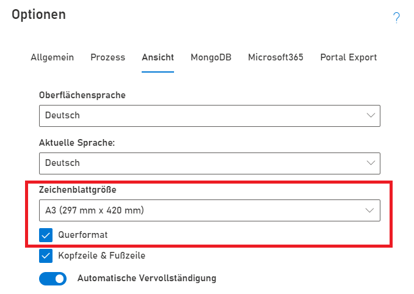

Standardmäßig kommt SemTalk Online mit einer freien Zeichenblattgröße. D.h. es gibt keine vordefinierten Zeichenblätter sondern eine große freie Fläche, die beliebig genutzt werden kann.

Wenn Dateien gedruckt werden oder einheitlich aussehen sollen, ist es jedoch sinnvoll eine Zeichenblattgröße zu wählen. Ebenso wird für die Nutzung von Hintergrundseiten eine definierte Zeichenblattgröße benötigt.

Dies kann in den SemTalk Optionen gemacht werden (Zahnrad oben rechts --> Tab Ansicht).

Es kann eine Zeichenblattgröße aus gängigen Normen ausgewählt sowie die Ausrichtung eingestellt werden.

Damit die Seitenränder sichtbar sind, lassen sich über den Menüeintrag Start --> Seitenumbruch die Seitenradnlinie einblenden.

