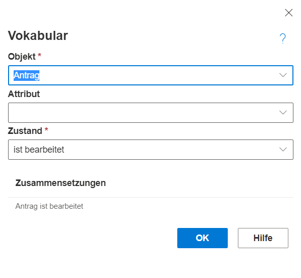

**Zustände** sind besonders in der BPMN-Notation bei Gateways und Ereignissen relevant. Zustände beschreiben den aktuellen Zustand eines Objektes, z.B. "Antrag eingetroffen" als Startereignis. Wobei "Antrag" das Objekt ist und dieses den Zustand "eingetroffen" besitzt, was zur Folge haben kann, dass ein Prozess zur Bearbeitung des Antrag durchgeführt wird.

Zum Setzen des Zustandes wird die Vokabularfunktionalität genutzt. (Rechtsklick auf ein Shape --> Vokabular. Details: [Wiki Seite: Vokabular](https://github.com/SemTalkOnline/SemTalkOnline_DE/wiki/Vocabulary)) Sind Zustände einmal angelegt, können sie innerhalb der Modelldatei mehrfach verwendet werden. Alle existierenden Zustände werden in der Auswahlbox angeboten. Neue Zustände können aber auch direkt eingegeben werden.

**Beispiele für Zustände können sein**:
* Bearbeitet
* Abgelehnt
* Eingetroffen
* In Bearbeitung
* In Review
* Reviewed
