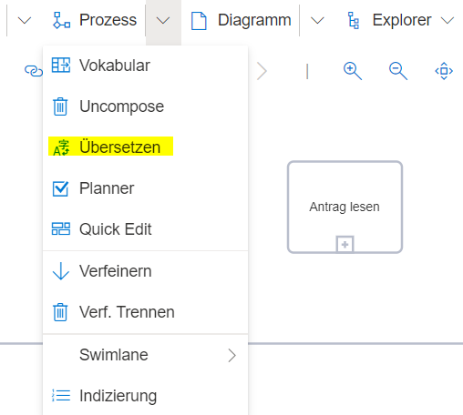
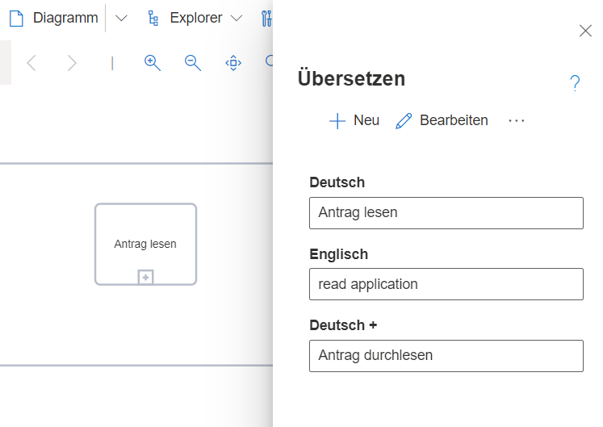
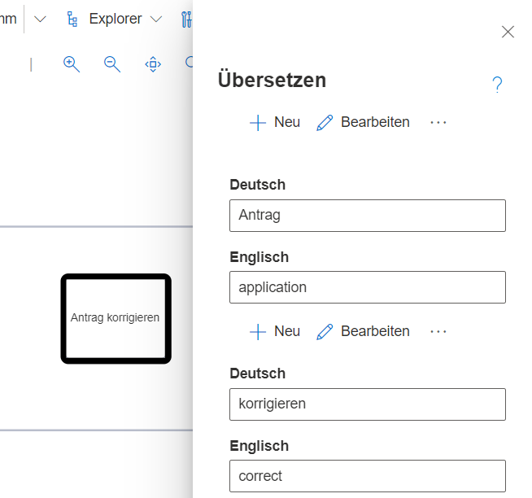

Das **Übersetzen**-Tool wird genutzt, um übersichtlich mehrsprachig zu modellieren. (Menüeintrag "Prozess" --> "Übersetzen")

Ist das Tool geöffnet, zeigt es immer die angelegten Spracheinträge für das zuletzt selektierte Modellelement.

Im Dialog lassen sich Übersetzungen hinzufügen, bearbeiten oder löschen. Neue Übersetzungen können dabei immer jeweils einer der vorhandenen Sprachen zugewiesen werden.

Über den Neu-Button kann ein neuer Begriff in der gewünschten Sprache hinzugefügt werden. Mir der Checkbox Synonym sind mehrere Begriffe in einer Sprache möglich.

**Einfache Benennung:** Sind Elemente nicht Vokabular-basiert angelegt worden, kann eine einfache Übersetzung des eingegebenen Namens vorgenommen werden.

**Hinweis:** 
Das Plus-Zeichen direkt nach der Sprachenbenennung bedeutet, dass zu einer bereits bestehenden Übersetzung (hier: Deutsch +) noch eine synonyme 
Formulierung hinzugefügt wurde.

**Vokabular-basierte Benennung:** Wird die Vokabularfunktionalität zur Benennung der Modellelemente genutzt, bietet das Übersetzen-Tool die Möglichkeit, eine Übersetzung des Objekts, des Zustandes oder der Methode unabhängig voneinander vorzunehmen. Mehr über Vokabular-basierte Modellierung kann auf der [Wiki Seite: Vokabular](https://github.com/SemTalkOnline/SemTalkOnline_DE/wiki/Vokabular) nachgelesen werden.

